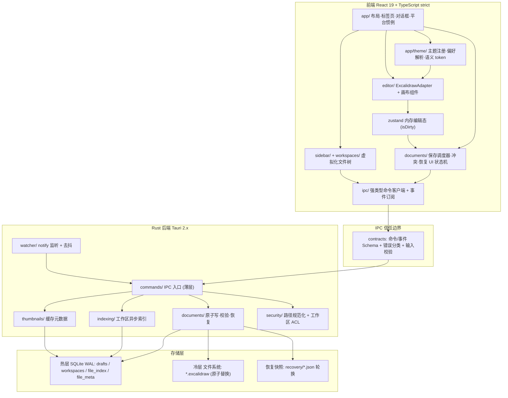
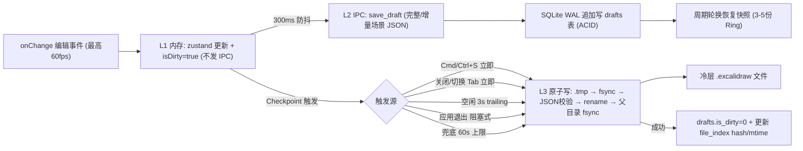
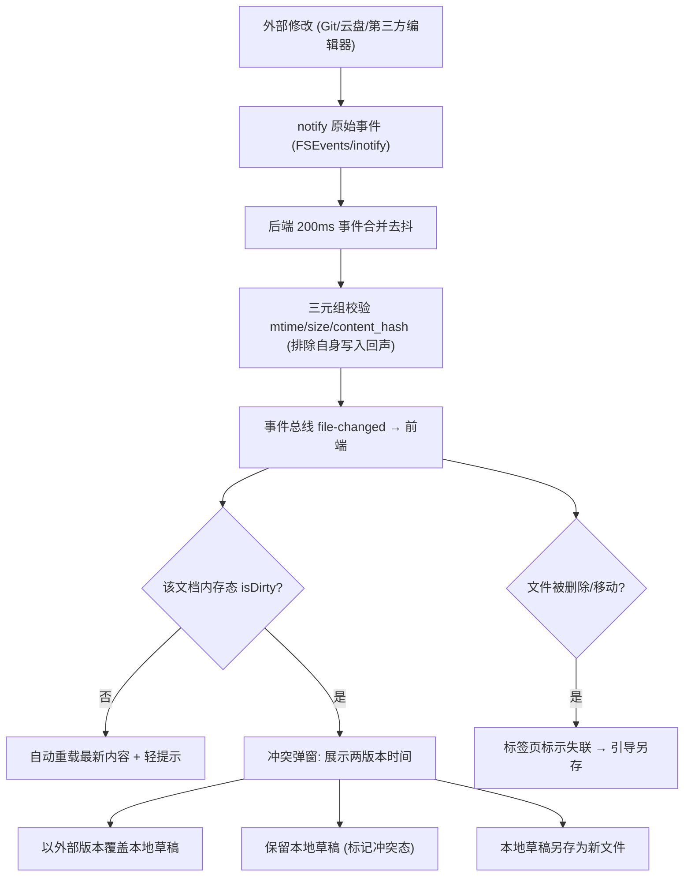

# Excalidraw Desktop 架构文档

**最后更新**：2026-08-10

本文档描述 Excalidraw Desktop 的实现架构：分层视图、两条关键数据流、模块职责、依赖方向与信任边界、安全路径与存储层。产品行为以 `specs/001-excalidraw-desktop/spec.md` 为准；决策记录见 `docs/adr/`；视觉与交互契约见根目录 `DESIGN.md`。

## 1. 总体结构

Tauri 2.x 双端布局：`src/` 为 React 19 + TypeScript strict 前端，`src-tauri/` 为 Rust 后端；两端经 IPC 契约边界通信（`specs/001-excalidraw-desktop/contracts/ipc-contracts.md`）。完整技术选型见 ADR-001（框架）、ADR-002/003（持久化）、ADR-004（参考性能测量）、ADR-005（主题边界）。

## 2. 分层视图

依赖方向自上而下单向：UI → Theme → Editor → Store → Docs → IpcClient → Contracts → Commands → 领域服务 → 存储。主题模块仅管理非文档外观偏好并向壳层/画布提供解析结果，不进入 IPC 或文档模型；前端不直接触达文件系统或数据库；所有路径进入后端后先经 `security/` 规范化并校验工作区白名单（FR-031）。

## 3. 数据流图 1：编辑 → 草稿 → 落盘（三级削峰）

高频编辑路径不逐事件执行完整场景序列化、IPC 传输或磁盘写入：L1 内存态更新（不发 IPC）、L2 经 300ms 防抖写入 SQLite WAL 草稿、L3 checkpoint 触发时原子落盘到冷层 `.excalidraw` 文件（SC-006 削峰 ≥95%）。原子写流水线与故障验证点见 ADR-002。

## 4. 数据流图 2：外部变更 → 冲突消解

外部变更在 3s 内感知（SC-008），以 (mtime, size, content_hash) 三元组校验真实变更并抑制自身写入回声；冲突态禁止自动 checkpoint，直至用户决策（FR-019）。

## 5. 模块职责

### 前端（src/）

| 模块 | 职责 |
|------|------|
| `app/` | 布局、标签页、全局对话框、菜单/快捷键（平台惯例集中层） |
| `app/theme/` | 主题类型、registry、偏好解析、语义 token 与启动前应用（DESIGN.md） |
| `editor/` | ExcalidrawAdapter + 画布组件、场景序列化、导出、离线字体加载、IME 桥接 |
| `documents/` | 保存调度器、冲突检测/对话框、恢复 UI 状态机 |
| `sidebar/` | 虚拟化文件树、缩略图懒生成队列（Worker） |
| `workspaces/` | 工作区挂载/移除 UI 与状态 |
| `ipc/` | 强类型命令绑定与事件订阅（contracts 的 TS 侧） |

### 后端（src-tauri/）

| 模块 | 职责 |
|------|------|
| `commands/` | IPC 命令入口（薄层：反序列化 → 校验 → 调领域服务） |
| `documents/` | 原子写、恢复、校验、资产去重、会话锁 |
| `database/` | 连接池、写线程、迁移、仓储 trait（隔离 SQLite/redb） |
| `indexing/` | 工作区异步扫描与增量索引 |
| `watcher/` | notify 封装 + 去抖 + 回声抑制 |
| `thumbnails/` | 缩略图缓存元数据与磁盘管理 |
| `security/` | 路径规范化、工作区 ACL 白名单 |

## 6. IPC 信任边界

- 契约：命令/事件 Schema + 错误分类 + 输入校验，唯一定义于 `contracts/ipc-contracts.md`；前端不得绕过。
- 所有前端传入路径在后端经 `security/` 的 `std::fs::canonicalize` + 工作区白名单校验（FR-031）；文档 JSON 视为不可信输入（结构校验 + 尺寸上限，FR-032）。
- 最小权限：Tauri Capabilities 最小集（core:default + 受限 dialog/fs scope），严格 CSP（FR-033）。

## 7. 存储层

| 层 | 载体 | 说明 |
|----|------|------|
| 热层 | SQLite WAL（drafts / workspaces / file_index / file_meta） | 草稿与索引，PRAGMA 基线见 data-model.md |
| 冷层 | 文件系统 `*.excalidraw`（原子替换） | 最终事实来源 |
| 恢复 | `recovery/*.json` 轮换快照 + `session.lock` | 崩溃恢复（SC-004） |

存储层设计细节见 ADR-002（双层持久化）与 ADR-003（SQLite-first 与 redb 触发条件）。

## 8. 相关文档

- ADR：ADR-001 框架选型、ADR-002 双层持久化、ADR-003 SQLite-first 与 redb 触发条件、ADR-004 声明参考环境性能测量、ADR-005 主题边界
- `DESIGN.md`（视觉与交互契约）
- `specs/001-excalidraw-desktop/`（spec.md、plan.md、research.md、data-model.md、contracts/、quickstart.md）
- `docs/native-verification.md`（记录配置的目标 OS 验证矩阵，VM 或物理机）
