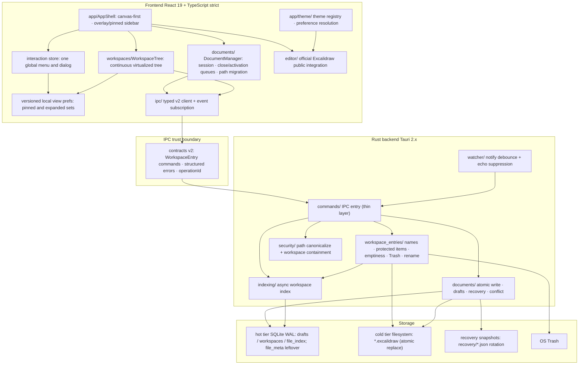
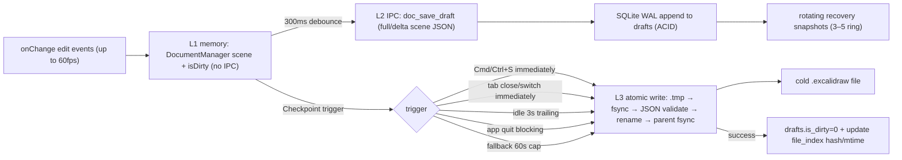
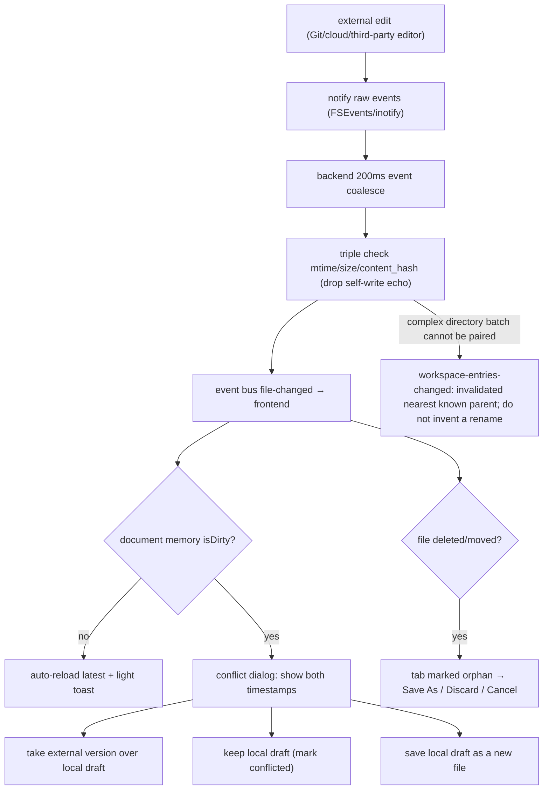
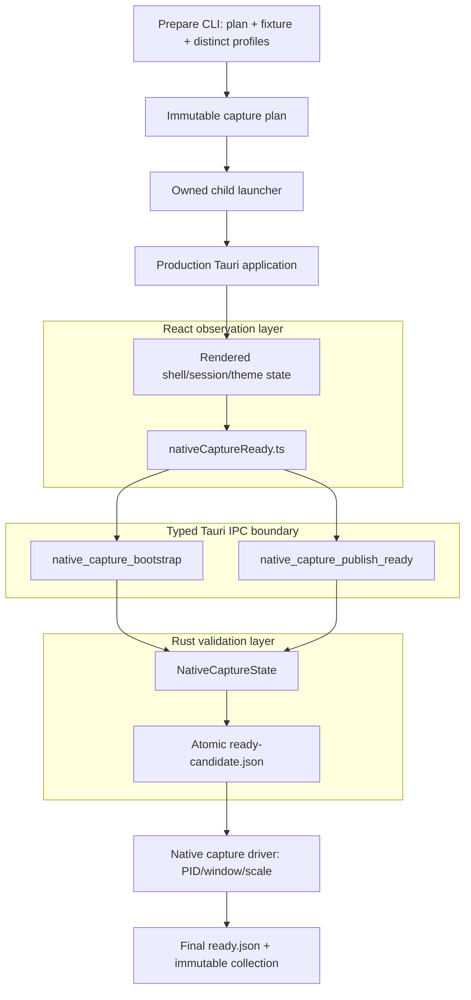

[English](architecture.md) | [简体中文](architecture.zh.md)

# Excalidraw Desktop architecture

**Last updated**: 2026-08-24

This document describes the **current** implementation architecture of Excalidraw Desktop: layered view, reliability data flows, workspace-entry mutations, module responsibilities, dependency direction and trust boundaries, native-window boundary, and storage. Decision records live in `docs/adr/`. The visual and interaction contract is the root `DESIGN.md` (English; Chinese: `DESIGN.zh.md`). The public IPC contract is `docs/contracts/ipc-contracts.md` (v2).

The current shell is a canvas-first overlay/pinned sidebar, IPC v2 Workspace Entry commands, and unified in-app menus/dialogs. Crash-safe persistence (drafts, atomic writes, recovery snapshots, external-change conflicts) still applies. What follows is the current path, not the retired FileTree + `thumbnails/` production implementation.

## 1. Overall structure

Tauri 2.x dual-process layout: `src/` is the React 19 + TypeScript strict frontend; `src-tauri/` is the Rust backend. The two sides communicate across an IPC contract boundary (`docs/contracts/ipc-contracts.md`). Full technology choices: ADR-001 (framework), ADR-002/003 (persistence), ADR-004/006/007/008 (reference performance measurement and budgets), ADR-005 (theme boundary; the “file manager on the left / canvas on the right” shell layout and thumbnail-contract sentences are superseded by ADR-009), ADR-009 (desktop UI interactions: title-bar option A, canvas-first sidebar, thumbnail retirement, IPC v2 WorkspaceEntry, unified menus/dialogs).

## 2. Layered view



Dependencies flow one way, top down: shell / interaction / tree / DocumentManager → IpcClient → Contracts → Commands → `security/` → domain services → storage.

Constraints (fixed jointly by the code and ADR-009):

- The frontend does not decide path authorization, directory emptiness, protected entries, Trash eligibility, or whether a rename commit succeeded; those live in Rust `workspace_entries/` and `security/`.
- The Workspace Entry domain does not take a frontend session id; the rename response returns `pathMigrations`, which DocumentManager applies to its own sessions.
- Tab presentation is derived from DocumentManager; there is no second source of truth for path/title/dirty/orphan.
- The interaction layer has at most one menu and one dialog globally (`src/app/interaction/interactionStore.ts`).
- **No thumbnail runtime**: there is no `thumbnails/` module, thumbnail Worker, or production `thumb_lookup` / `thumb_store`. The asset protocol only serves real in-drawing image assets (`.excalidraw_assets`).
- The native title bar is outside Web content: ordinary decorated `Visible` window, OS-controlled title-bar color, normal stacking; the production path is not always-on-top.

The theme module only manages non-document appearance preferences and supplies resolved values to the shell/canvas. It does not enter IPC or the document model.

## 3. Data-flow 1: edit → draft → disk (three-tier coalescing)



The high-frequency edit path does not serialize the full scene, send IPC, or write disk on every event: L1 updates in-memory state (no IPC), L2 writes a SQLite WAL draft after a 300ms debounce, and L3 atomically lands the cold `.excalidraw` file when a checkpoint fires, so most edit events never write the cold file immediately. The atomic-write pipeline and fault-injection points are in ADR-002.

## 4. Data-flow 2: external change → conflict resolution

Entry rename or delete coordinates with this external-change flow. It does not weaken atomic writes, recovery snapshots, conflict blocking, or debounce/coalesce.



External changes are perceived within about 3 seconds. A (mtime, size, content_hash) triple confirms a real change and suppresses self-write echo. A conflicted document must not auto-checkpoint until the user chooses in the conflict dialog. The app's own entry mutations treat the command response as authoritative; watcher events that match `operationId` are echo.

## 5. Data-flow 3: workspace entry create / rename / delete

A filesystem rename, the OS Trash, or an atomic create is the commit point. Failure before commit must keep the old path. After commit, derived index/watcher work may retry, but it must not report an already-committed disk change as uncommitted.

```mermaid
flowchart LR
    Intent["user entry action"] --> UIState{"action"}
    UIState -->|"create / rename"| Naming["app naming dialog"]
    Naming -->|"cancel"| NoMutation["close and restore focus; zero mutation"]
    Naming -->|"submit"| Preflight["DocumentManager identifies affected Open Documents"]
    Preflight --> Checkpoint["checkpoint affected sessions and capture baseHash"]
    Checkpoint --> MutCmd["workspace_entry_create / workspace_entry_rename"]
    UIState -->|"delete"| Dirty{"open and dirty/conflicted/saving?"}
    Dirty -->|"yes"| FocusDoc["block and focus the Open Document"]
    Dirty -->|"no"| DeleteCheck["workspace_entry_delete_preflight"]
    DeleteCheck -->|"non-empty directory"| Blocker["app blocker dialog"]
    DeleteCheck -->|"confirmable"| Confirm["app delete confirmation"]
    Confirm -->|"confirm"| DeleteCmd["workspace_entry_delete; carries expectedOpenDocument"]
    MutCmd --> RustGate["Rust Workspace mutation gate"]
    DeleteCmd --> RustGate
    RustGate --> SecurityCheck["containment, symlink, protected, name/conflict/emptiness"]
    SecurityCheck -->|"fail"| StructuredError["structured error; dialog/tree/session unchanged"]
    SecurityCheck -->|"Rename commit"| FsRename["filesystem rename"]
    SecurityCheck -->|"Delete commit"| OsTrash["OS Trash"]
    SecurityCheck -->|"Create commit"| FsCreate["atomic Drawing or Directory create"]
    FsRename --> Result["response: operationId + pathMigrations"]
    OsTrash --> Cleanup["delete exact clean draft/index metadata"]
    Cleanup --> Result
    FsCreate --> Result
    Result --> Apply["DocumentManager applies session changes once"]
    Apply --> Refresh["invalidate tree; restore scroll anchor and focus"]
```



Authoritative layers: `src-tauri/src/workspace_entries/` and `src/documents/documentStore.ts`. New drawings default to the visible name `Untitled`; Rust appends `.excalidraw`. New directories default to `Untitled Folder` (`src/app/interaction/EntryNamingDialog.tsx`). Protected targets include the workspace root, dot directories, and `.excalidraw_assets`.

## 6. Sequence: serialized close and latest-intent activation

```mermaid
sequenceDiagram
    participant Input as Tab / wheel input
    participant DM as DocumentManager
    participant Scheduler as DraftScheduler
    participant IPC as Rust document commands
    participant UI as TabBar
    Input->>DM: requestClose(id) or requestActivation(id)
    alt the same close is already in flight
        DM-->>Input: join the existing result
    else start activation or close
        DM->>Scheduler: checkpoint current/target as needed
        Note over DM: a newer activation only replaces pendingLatestId
        Scheduler->>IPC: doc_checkpoint
        IPC-->>Scheduler: success or structured failure
        alt success
            DM->>IPC: on close, doc_close (checkpointed or discardOrphan)
            DM->>UI: update the single session/tab order
            DM->>DM: drain only the latest pending activation
        else failure or cancel
            DM->>UI: keep the tab and focus; show the error
            Note over DM: a batch close stops before unprocessed ids
        end
    end
```

Closing an orphaned document must not send a checkpoint that requires the missing path to exist. `doc_close` with `discardOrphan` only clears draft/recovery/session records for that path.

## 7. Module responsibilities

### Frontend (`src/`)

| Module | Responsibility |
|--------|----------------|
| `app/AppShell.tsx` | Canvas-first shell; overlay covers the canvas without changing the canvas box; pinned enters the layout; no empty right pane |
| `app/sidebarController.ts` | Sidebar `hidden` / `overlay` / `pinned`; overlay auto-closes 500ms after pointer leave; focus/menu/dialog/drag hold pauses auto-close |
| `app/interaction/` | One global menu and dialog, focus return; naming/delete/blocker dialogs; no `window.prompt` / `window.confirm` |
| `app/theme/` | Theme types, registry, preference resolution, semantic tokens, and pre-startup apply (DESIGN.md); decoupled from system title-bar color |
| `editor/` | ExcalidrawAdapter + canvas, scene serialization, export, offline fonts, IME bridge; only the locked package's public API |
| `documents/` | DocumentManager: session identity, tab order, dirty/orphan/conflict, close/activation queues, path migration, recovery UI |
| `workspaces/WorkspaceTree.tsx` | One continuous virtualized workspace tree (several workspaces, one scroll surface); no thumbnail rows |
| `ipc/` | Typed v2 command bindings and event subscription (`IPC_CONTRACT_VERSION = 2`) |

### Backend (`src-tauri/`)

| Module | Responsibility |
|--------|----------------|
| `commands/` | IPC command entry (thin layer: deserialize → validate → call domain services) |
| `workspace_entries/` | Workspace Entry domain: names, extension, protected items, real emptiness, conflicts, Trash, rename commit point, pathMigrations |
| `documents/` | Atomic write, recovery, validation, asset dedup, session lock |
| `database/` | Connection pool, writer thread, migrations, repository traits; runtime no longer reads/writes `file_meta` as a thumbnail cache |
| `indexing/` | Async workspace scan and incremental index |
| `watcher/` | notify wrapper + debounce + echo suppression; complex external directory events emit `invalidated` |
| `security/` | Path canonicalize, workspace ACL allowlist, symlink-escape rejection |

Historical `thumbnails/` and frontend `FileTree` / `useThumbnails` are **not** the current production path.

## 8. IPC trust boundary

- Contract: command/event schemas + error taxonomy + input validation are defined only in `docs/contracts/ipc-contracts.md`. The TypeScript source is `src/ipc/contracts.ts`; Rust DTOs are `src-tauri/src/commands/dto.rs`. The frontend must not bypass them. Current `IPC_CONTRACT_VERSION = 2`.
- Entry-mutation authorization uses `workspaceId + relativePath` (plus `baseName` for create/rename). `canonicalPath` in the response is for opening and session migration. It is **not** authorization evidence the frontend may submit.
- Every path is canonicalized in the backend by `security/` and checked against the workspace allowlist. Escape returns `PATH_ACCESS_DENIED`. Document JSON is untrusted input (structure validation + size cap).
- Least privilege: Tauri capabilities are `core:default` + `core:window:allow-destroy` + `dialog:allow-open` + `dialog:allow-save` (`src-tauri/capabilities/default.json`). The window permission lets the native close handler destroy the main window only after its app-exit checkpoint completes. Path ACL lives in Rust; extra fs capabilities are not used to give the WebView arbitrary filesystem access. Strict CSP; the asset protocol is limited to `.excalidraw_assets` images.
- The production command set does not include `dir_list`, `file_create` / `file_rename` / `file_delete`, or `thumb_lookup` / `thumb_store`.

## 9. Native-window boundary (option A)

Configuration and implementation: `src-tauri/tauri.conf.json` (window `title`) and `src-tauri/src/lib.rs` (no production title-bar tint / always-on-top). ADR-009 records the choice.

| Item | Current product behavior |
|------|--------------------------|
| Window model | Ordinary decorated window; Overlay / Transparent / frameless are not configured |
| Title | `Excalidraw Whiteboard` |
| Title-bar color | OS-controlled; not forced by content `light \| dark \| system` |
| Content theme | Frontend resolves independently; `system` follows `prefers-color-scheme` |
| Stacking | Normal z-order; other apps can cover it; it can minimize and restore |
| always-on-top | Off in production. `e2e_harness` may pin the measurement window only when `EXCALIDRAW_PERF_CONTROL_DIR` exists; that must not leak into production |

## 10. Storage

| Tier | Carrier | Notes |
|------|---------|-------|
| Hot | SQLite WAL (`drafts` / `workspaces` / `file_index`) | Drafts and index. The v1 `file_meta` table is a lazy compatibility leftover, not an active thumbnail cache |
| Cold | Filesystem `*.excalidraw` (atomic replace); `.excalidraw.json` is recognized | Source of truth; new drawings default to `.excalidraw` |
| Recovery | `recovery/*.json` rotating snapshots + `session.lock` | Crash recovery |
| Trash | OS Trash | Commit point for empty Directory and clean Drawing deletes; no recursive / permanent-delete command |

Storage design detail is in ADR-002 (two-tier persistence) and ADR-003 (SQLite-first and the redb trigger). The hot tier keeps WAL drafts. Do not switch back to in-place cold-file overwrites, and do not remove recovery snapshots.

## 11. Native visual validation layers

The production application contains an observation-only ready probe. It is inert unless a launcher supplies a complete capture plan, gate, and nonce. The prepare tool owns disposable fixture/profile creation; React observes rendered shell state; Rust validates the immutable binding and actual storage containment; the native capture driver owns PID/window lookup and image capture. No layer may use the probe to set theme, sidebar, documents, workspace data, or permissions.



## 12. Native capture request-to-ready flow

```mermaid
sequenceDiagram
  participant P as Prepare CLI
  participant L as Owned launcher
  participant R as Rust NativeCaptureState
  participant W as React WebView
  participant D as Native capture driver
  P->>P: Validate package/manifest/fixture paths
  P->>P: Create distinct empty profiles and plan
  L->>R: Launch with plan + gate + nonce
  R->>R: Resolve actual app-data/WebKit paths
  R-->>W: Bootstrap immutable expected binding
  W->>W: Observe shell state; await document.fonts.ready
  W->>W: Confirm zero remote fonts, zero pending work, two stable frames
  W->>R: Publish typed ready observation
  R->>R: Validate nonce/fingerprint/window size/path containment
  R-->>D: Atomically publish ready-candidate.json
  D->>D: Bind owned PID to one native window and backing scale
  D->>D: Validate dimensions and finalize ready.json
  D->>D: Capture once; normalize without crop or repair
```

The launcher owns only its child process and profile. Missing isolation, a storage path outside the profile, an ambiguous process/window, a ready timeout, or a changed package/plan produces structured `BLOCKED` evidence. The observation candidate is not visual evidence and cannot replace native window facts or independent visual review.

## 13. Related documents

- ADRs: ADR-001 framework choice, ADR-002 two-tier persistence, ADR-003 SQLite-first and redb trigger, ADR-004 declared reference-environment performance measurement, ADR-005 theme boundary (shell-layout / thumbnail sentences: see ADR-009), ADR-006/007/008 reference performance budgets and measurement series, ADR-009 desktop UI interactions
- `DESIGN.md` / `DESIGN.zh.md` (visual and interaction contract)
- `docs/quickstart.md` / `docs/quickstart.zh.md` (getting started and verification), `docs/contracts/ipc-contracts.md` (IPC contract v2)
- `docs/evidence/` (native verification matrix, accessibility audit, and validation summary; VM or physical machine)
