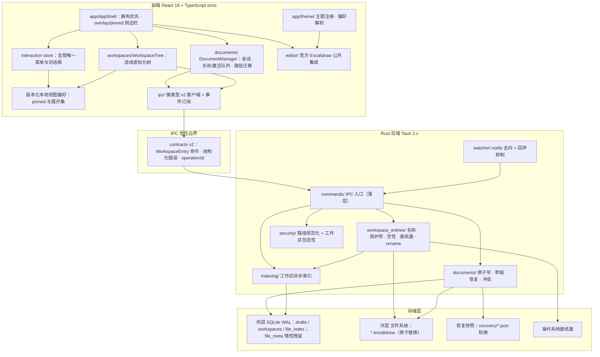
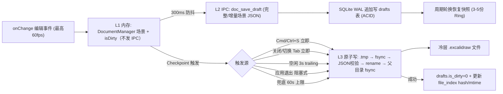
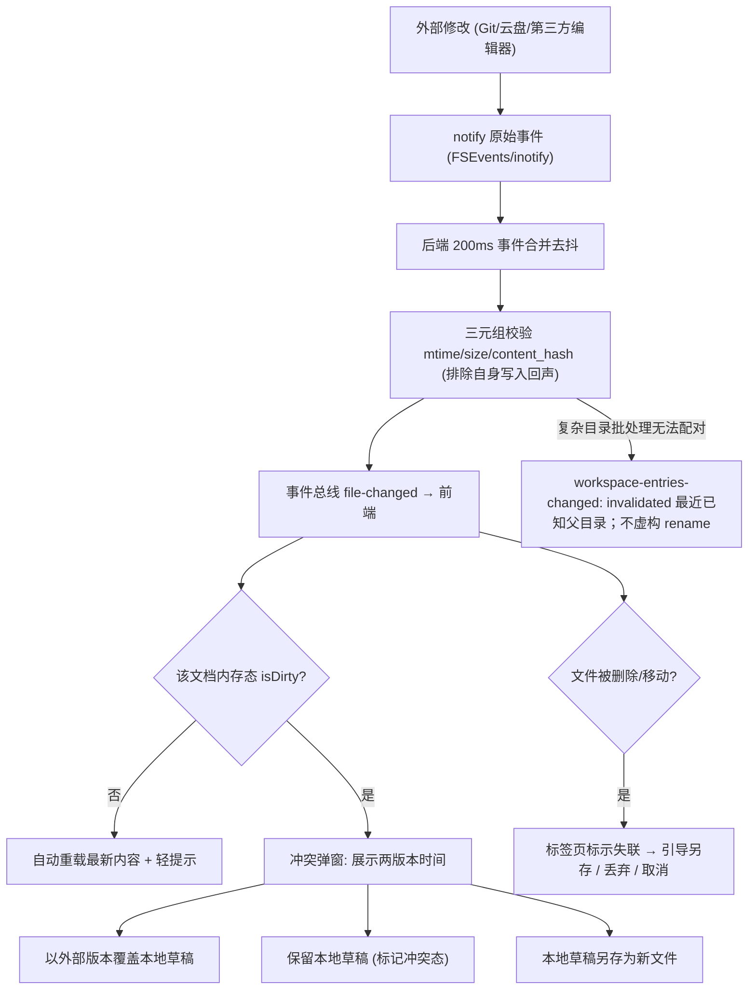
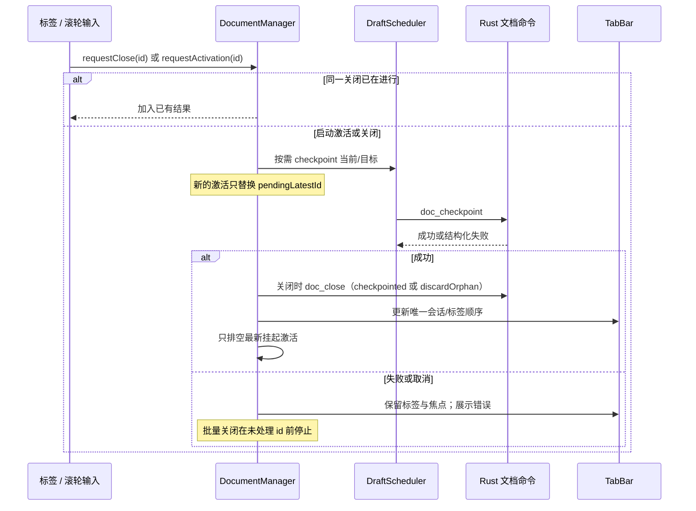

[English](architecture.md) | [简体中文](architecture.zh.md)

# Excalidraw Desktop 架构文档

**最后更新**：2026-08-24

本文档描述 Excalidraw Desktop 的**当前**实现架构：分层视图、可靠性数据流、工作区条目变更、模块职责、依赖方向与信任边界、原生窗口边界与存储层。决策记录见 `docs/adr/`；视觉与交互契约见根目录 `DESIGN.md`（英文正文；中文见 `DESIGN.zh.md`）。公开 IPC 契约见 `docs/contracts/ipc-contracts.md`（v2）。

当前壳层是画布优先的 overlay/pinned 侧边栏、IPC v2 Workspace Entry 命令，以及统一的应用菜单/对话框。崩溃安全持久化（草稿、原子写、恢复快照、外部变更冲突）仍然有效。下文描述的是现行路径，不是已退休的 FileTree + `thumbnails/` 生产实现。

## 1. 总体结构

Tauri 2.x 双端布局：`src/` 为 React 19 + TypeScript strict 前端，`src-tauri/` 为 Rust 后端；两端经 IPC 契约边界通信（`docs/contracts/ipc-contracts.md`）。完整技术选型见 ADR-001（框架）、ADR-002/003（持久化）、ADR-004/006/007/008（参考性能测量与预算）、ADR-005（主题边界，其中「左侧文件管理 / 右侧画布」壳层布局与缩略图契约句已被 ADR-009 取代）、ADR-009（桌面 UI 交互：标题栏选择 A、画布优先侧边栏、缩略图退休、IPC v2 WorkspaceEntry、统一菜单/对话框）。

## 2. 分层视图

依赖方向自上而下单向：壳层 / 交互 / 树 / DocumentManager → IpcClient → Contracts → Commands → `security/` → 领域服务 → 存储。

约束（由代码与 ADR-009 共同固定）：

- 前端不裁决路径授权、目录空性、受保护条目、废纸篓资格或 rename 提交是否成功；这些在 Rust `workspace_entries/` 与 `security/`。
- Workspace Entry 领域不接收前端 session id；rename 响应返回 `pathMigrations`，由 DocumentManager 应用到自己的会话。
- 标签呈现派生自 DocumentManager；不另建一套 path/title/dirty/orphan 权威。
- 交互层全局至多一个菜单、一个对话框（`src/app/interaction/interactionStore.ts`）。
- **无缩略图运行时**：不存在 `thumbnails/` 模块、缩略图 Worker、或生产 `thumb_lookup` / `thumb_store`。asset protocol 仅服务于图纸内真实图片资产（`.excalidraw_assets`）。
- 原生标题栏在 Web 内容之外：普通装饰 `Visible` 窗口、系统控制标题栏颜色、正常层级；生产路径不 always-on-top。

主题模块仅管理非文档外观偏好并向壳层/画布提供解析结果，不进入 IPC 或文档模型。

## 3. 数据流图 1：编辑 → 草稿 → 落盘（三级削峰）

高频编辑路径不逐事件执行完整场景序列化、IPC 传输或磁盘写入：L1 内存态更新（不发 IPC）、L2 经 300ms 防抖写入 SQLite WAL 草稿、L3 checkpoint 触发时原子落盘到冷层 `.excalidraw` 文件，使绝大多数编辑事件不必立刻写冷文件。原子写流水线与故障验证点见 ADR-002。

## 4. 数据流图 2：外部变更 → 冲突消解

条目重命名或删除会协调这条外部变更流，但不削弱原子写、恢复快照、冲突阻塞或去抖/合并。

外部变更大约在 3 秒内感知，以 (mtime, size, content_hash) 三元组校验真实变更并抑制自身写入回声；冲突态禁止自动 checkpoint，直至用户在冲突对话框中作出选择。应用自身条目变更以命令响应为权威，匹配 `operationId` 的 watcher 事件视为回声。

## 5. 数据流图 3：工作区条目创建 / 重命名 / 删除

文件系统 rename、操作系统废纸篓或原子创建才是提交点。提交前失败必须保持旧路径；提交后派生索引/watcher 可以重试，但不能把已提交的磁盘变更报告为未提交。

```mermaid
flowchart LR
    Intent["用户条目操作"] --> UIState{"动作"}
    UIState -->|"创建 / 重命名"| Naming["应用命名对话框"]
    Naming -->|"取消"| NoMutation["关闭并恢复焦点；零变更"]
    Naming -->|"提交"| Preflight["DocumentManager 识别受影响 Open Document"]
    Preflight --> Checkpoint["checkpoint 受影响会话并捕获 baseHash"]
    Checkpoint --> MutCmd["workspace_entry_create / workspace_entry_rename"]
    UIState -->|"删除"| Dirty{"打开且 dirty/conflicted/saving?"}
    Dirty -->|"是"| FocusDoc["阻断并聚焦对应 Open Document"]
    Dirty -->|"否"| DeleteCheck["workspace_entry_delete_preflight"]
    DeleteCheck -->|"非空目录"| Blocker["应用阻断对话框"]
    DeleteCheck -->|"可确认"| Confirm["应用删除确认"]
    Confirm -->|"确认"| DeleteCmd["workspace_entry_delete；携带 expectedOpenDocument"]
    MutCmd --> RustGate["Rust Workspace mutation gate"]
    DeleteCmd --> RustGate
    RustGate --> SecurityCheck["包含性、符号链接、保护项、名称/冲突/空性"]
    SecurityCheck -->|"失败"| StructuredError["结构化错误；对话框/树/会话保持"]
    SecurityCheck -->|"Rename 提交"| FsRename["文件系统 rename"]
    SecurityCheck -->|"Delete 提交"| OsTrash["操作系统废纸篓"]
    SecurityCheck -->|"Create 提交"| FsCreate["原子 Drawing 或 Directory 创建"]
    FsRename --> Result["响应：operationId + pathMigrations"]
    OsTrash --> Cleanup["删除精确的干净 draft/index 元数据"]
    Cleanup --> Result
    FsCreate --> Result
    Result --> Apply["DocumentManager 一次性应用会话变更"]
    Apply --> Refresh["树失效并恢复滚动锚点与焦点"]
```

权威层划分见 `src-tauri/src/workspace_entries/` 与 `src/documents/documentStore.ts`。新建图纸默认可见名 `Untitled`，Rust 追加 `.excalidraw`；新建目录默认 `Untitled Folder`（`src/app/interaction/EntryNamingDialog.tsx`）。受保护目标包括工作区根、点号目录与 `.excalidraw_assets`。

## 6. 序列：串行关闭与最新意图激活

失联文档关闭不得对已缺失路径再发需要该路径存在的 checkpoint；`doc_close` 的 `discardOrphan` 只清理该路径的 draft/recovery/session 记录。

## 7. 模块职责

### 前端（src/）

| 模块 | 职责 |
|------|------|
| `app/AppShell.tsx` | 画布优先壳层；overlay 覆盖画布且不改变画布盒；pinned 进入布局；无空右侧栏 |
| `app/sidebarController.ts` | 侧边栏 `hidden` / `overlay` / `pinned`；overlay 指针离开 500ms 延迟关闭；focus/menu/dialog/drag hold 暂停自动关闭 |
| `app/interaction/` | 全局唯一菜单与对话框、焦点返回；命名/删除/阻断对话框；不使用 `window.prompt` / `window.confirm` |
| `app/theme/` | 主题类型、registry、偏好解析、语义 token 与启动前应用（DESIGN.md）；与系统标题栏颜色解耦 |
| `editor/` | ExcalidrawAdapter + 画布组件、场景序列化、导出、离线字体、IME 桥接；只走锁定包的公开 API |
| `documents/` | DocumentManager：会话身份、标签顺序、dirty/orphan/conflict、关闭/激活队列、路径迁移、恢复 UI |
| `workspaces/WorkspaceTree.tsx` | 单一连续虚拟化工作区树（多工作区一个滚动面）；无缩略图行 |
| `ipc/` | 强类型 v2 命令绑定与事件订阅（`IPC_CONTRACT_VERSION = 2`） |

### 后端（src-tauri/）

| 模块 | 职责 |
|------|------|
| `commands/` | IPC 命令入口（薄层：反序列化 → 校验 → 调领域服务） |
| `workspace_entries/` | Workspace Entry 领域：名称、扩展名、保护项、真实空性、冲突、Trash、rename 提交点、pathMigrations |
| `documents/` | 原子写、恢复、校验、资产去重、会话锁 |
| `database/` | 连接池、写线程、迁移、仓储 trait；运行时不再把 `file_meta` 当缩略图缓存读写 |
| `indexing/` | 工作区异步扫描与增量索引 |
| `watcher/` | notify 封装 + 去抖 + 回声抑制；复杂外部目录事件发 `invalidated` |
| `security/` | 路径规范化、工作区 ACL 白名单、符号链接逃逸拒绝 |

历史 `thumbnails/` 与前端 `FileTree` / `useThumbnails` **不是**当前生产路径。

## 8. IPC 信任边界

- 契约：命令/事件 Schema + 错误分类 + 输入校验，唯一定义于 `docs/contracts/ipc-contracts.md`；TypeScript 源为 `src/ipc/contracts.ts`，Rust DTO 为 `src-tauri/src/commands/dto.rs`。前端不得绕过。当前 `IPC_CONTRACT_VERSION = 2`。
- 条目变更授权使用 `workspaceId + relativePath`（及创建/重命名的 `baseName`）。响应中的 `canonicalPath` 供打开与会话迁移使用，**不是**前端可提交的授权证据。
- 所有路径在后端经 `security/` canonicalize + 工作区白名单校验；越界返回 `PATH_ACCESS_DENIED`。文档 JSON 视为不可信输入（结构校验 + 尺寸上限）。
- 最小权限：Tauri Capabilities 为 `core:default` + `core:window:allow-destroy` + `dialog:allow-open` + `dialog:allow-save`（`src-tauri/capabilities/default.json`）。该窗口权限仅用于让原生关闭处理器在 app-exit checkpoint 完成后销毁主窗口。路径 ACL 在 Rust，不靠额外 fs capability 放开 WebView 任意文件系统。严格 CSP；asset protocol 仅限 `.excalidraw_assets` 图片。
- 生产命令集不含 `dir_list`、`file_create` / `file_rename` / `file_delete`、`thumb_lookup` / `thumb_store`。

## 9. 原生窗口边界（选择 A）

配置与实现见 `src-tauri/tauri.conf.json`（窗口 `title`）与 `src-tauri/src/lib.rs`（无生产标题栏着色 / 置顶）。ADR-009 记录该选择。

| 项 | 当前产品行为 |
|----|----------------|
| 窗口模型 | 普通装饰窗口；未配置 Overlay / Transparent / frameless |
| 标题 | `Excalidraw Whiteboard` |
| 标题栏颜色 | 由操作系统控制，不随内容 `light \| dark \| system` 强制 |
| 内容主题 | 前端独立解析；`system` 跟随 `prefers-color-scheme` |
| 层级 | 正常堆叠；可被其他应用覆盖、最小化、恢复 |
| always-on-top | 生产关闭。`e2e_harness` 仅在 `EXCALIDRAW_PERF_CONTROL_DIR` 存在时可为测量窗口置顶，不得泄漏到生产 |

## 10. 存储层

| 层 | 载体 | 说明 |
|----|------|------|
| 热层 | SQLite WAL（drafts / workspaces / file_index） | 草稿与索引。v1 `file_meta` 表作为惰性兼容残留保留，不是活动缩略图缓存 |
| 冷层 | 文件系统 `*.excalidraw`（原子替换）；支持识别 `.excalidraw.json` | 最终事实来源；新建图纸默认写入 `.excalidraw` |
| 恢复 | `recovery/*.json` 轮换快照 + `session.lock` | 崩溃恢复 |
| 废纸篓 | 操作系统 Trash | 空 Directory 与干净 Drawing 的删除提交点；无递归/永久删除命令 |

存储层设计细节见 ADR-002（双层持久化）与 ADR-003（SQLite-first 与 redb 触发条件）。热层保持 WAL 草稿，不改回就地覆盖冷文件，也不拆除恢复快照。

## 11. 相关文档

- ADR：ADR-001 框架选型、ADR-002 双层持久化、ADR-003 SQLite-first 与 redb 触发条件、ADR-004 声明参考环境性能测量、ADR-005 主题边界（壳层布局/缩略图句见 ADR-009）、ADR-006/007/008 参考性能预算与测量序列、ADR-009 桌面 UI 交互
- `DESIGN.md` / `DESIGN.zh.md`（视觉与交互契约）
- `docs/quickstart.md` / `docs/quickstart.zh.md`（上手与验证）、`docs/contracts/ipc-contracts.md`（IPC 契约 v2）
- `docs/evidence/`（原生验证矩阵、无障碍审计与验证汇总，VM 或物理机）
