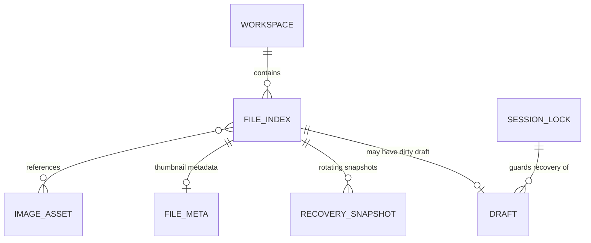
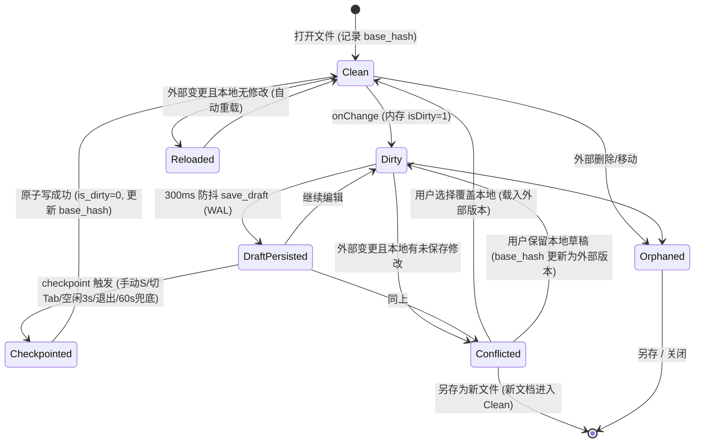

# Data Model: 跨平台 Excalidraw Desktop

**Date**: 2026-08-04 | **Plan**: [plan.md](./plan.md) | **Spec 实体来源**: [spec.md](./spec.md) Key Entities

本文件是数据模型的单一权威定义。校验规则在 Rust 后端实现一次，前端不得重复实现业务校验（宪法原则 I）。

## 1. 实体总览与关系



| 实体 | 载体 | 生命周期所有者 |
|------|------|--------------|
| Workspace | SQLite `workspaces` | 用户挂载/移除 |
| Document（文件本体） | 文件系统 `.excalidraw`（冷层，事实来源） | 用户/外部工具 |
| FileIndex | SQLite `file_index` | 后端索引引擎 |
| Draft | SQLite `drafts` | 保存调度器 |
| RecoverySnapshot | 应用数据目录 `recovery/<doc-hash>/recovery-NNN.json` | 恢复管理器（Ring 轮换） |
| FileMeta（缩略图元数据） | SQLite `file_meta` + 磁盘 WebP 缓存 | 缩略图子系统 |
| ImageAsset | 工作区 `.excalidraw_assets/<sha256>` | 资产去重子系统 |
| SessionLock | 应用数据目录 `session.lock` | 应用生命周期 |
| Tab（标签页） | 前端内存（zustand，不持久化业务规则） | 前端 app 层 |

## 2. SQLite Schema（migrations/0001_init.sql）

```sql
PRAGMA journal_mode = WAL;
PRAGMA busy_timeout = 5000;
PRAGMA foreign_keys = ON;
PRAGMA synchronous = NORMAL;

CREATE TABLE IF NOT EXISTS workspaces (
    id          TEXT PRIMARY KEY,             -- UUID v4
    name        TEXT NOT NULL,                -- 显示名，非空且去首尾空白
    root_path   TEXT NOT NULL UNIQUE,         -- canonicalize 后的绝对路径
    created_at  INTEGER NOT NULL              -- Unix 秒
);

CREATE TABLE IF NOT EXISTS file_index (
    canonical_path TEXT PRIMARY KEY,          -- canonicalize 后的绝对路径
    workspace_id   TEXT NOT NULL,
    display_name   TEXT NOT NULL,
    relative_path  TEXT NOT NULL,             -- 相对 workspace root，禁含 ".."
    mtime          INTEGER NOT NULL,
    file_size      INTEGER NOT NULL,
    content_hash   TEXT,                      -- SHA-256 hex；索引扫描时可延迟计算
    FOREIGN KEY(workspace_id) REFERENCES workspaces(id) ON DELETE CASCADE
);
CREATE INDEX IF NOT EXISTS idx_file_index_ws ON file_index(workspace_id);

CREATE TABLE IF NOT EXISTS drafts (
    file_path    TEXT PRIMARY KEY,            -- canonical path；未命名新文档用 "untitled:<uuid>"
    scene_json   TEXT NOT NULL,               -- 完整 scene（elements + appState 子集 + files 引用）
    content_hash TEXT NOT NULL,               -- scene_json 的 SHA-256
    base_hash    TEXT,                        -- 草稿基于的冷层文件 hash（冲突/恢复比对）
    updated_at   INTEGER NOT NULL,
    is_dirty     INTEGER NOT NULL DEFAULT 1   -- 1=有未 checkpoint 修改
);
CREATE INDEX IF NOT EXISTS idx_drafts_dirty ON drafts(is_dirty);

CREATE TABLE IF NOT EXISTS file_meta (
    canonical_path   TEXT PRIMARY KEY,
    thumbnail_key    TEXT NOT NULL,           -- SHA256(content + renderer_version + theme)
    thumbnail_path   TEXT NOT NULL,           -- cache/thumbnails/aa/bb/<key>.webp
    generated_at     INTEGER NOT NULL,
    renderer_version TEXT NOT NULL,
    theme            TEXT NOT NULL CHECK (theme IN ('light','dark'))
);
```

迁移策略：`migrations/` 按序号递增，启动时事务化应用，`PRAGMA user_version` 记录版本；迁移失败回滚并拒绝启动（数据安全优先）。

## 3. 实体字段与校验规则（后端单一实现）

### Workspace

| 字段 | 类型 | 校验 |
|------|------|------|
| id | UUID v4 | 服务端生成 |
| name | String | 1–128 字符，去首尾空白后非空 |
| root_path | PathBuf | 必须存在、为目录、经 `canonicalize`；不得是已挂载工作区的祖先或后代（避免嵌套双索引）；不得是系统敏感路径 |

### Document / FileIndex

| 字段 | 类型 | 校验 |
|------|------|------|
| canonical_path | PathBuf | `canonicalize` 后必须位于某已挂载工作区内（前缀白名单，FR-031） |
| 扩展名 | — | 仅 `.excalidraw` / `.excalidraw.json` 进入索引 |
| content | JSON | 读取时校验：顶层 `type == "excalidraw"`、`version`、`elements` 为数组；超限（默认 256MB）拒绝加载；解析失败进入"损坏文件"错误态，不崩溃、不写回 |

### Draft

| 字段 | 校验 |
|------|------|
| scene_json | 必须可反序列化为合法 scene；写入前计算 content_hash 一致性 |
| base_hash | 打开文档时记录冷层 hash；checkpoint 成功后更新 |
| is_dirty | 仅保存调度器可置 1，checkpoint 成功原子置 0 |

### RecoverySnapshot（文件格式）

```json
{
  "documentId": "uuid-v4",
  "originalPath": "/abs/path/architecture.excalidraw",
  "baseFileHash": "sha256-hex",
  "savedAt": 1720000000,
  "appVersion": "0.1.0",
  "scene": { "elements": [], "appState": {}, "files": {} }
}
```

- 每文档目录 `recovery/<sha256(originalPath)>/` 下保留 `recovery-001..005.json`，Ring 覆盖最旧。
- 读取时逐个反序列化校验，损坏则跳过取次新（Edge Case：快照自损）。
- 恢复判定：`snapshot.savedAt > coldFile.mtime` 且 `snapshot.baseFileHash != coldFile.hash` 时提示恢复。

### ImageAsset

| 字段 | 校验 |
|------|------|
| hash | 二进制内容 SHA-256，即文件名 `.excalidraw_assets/<hash>`（保留原始格式字节，不转码） |
| 引用计数 | 由文档 files 字典引用关系派生，孤儿资产由后台清理任务回收（延迟删除，防误删） |
| 导出重组 | 对外保存/导出时按官方规范重新内嵌为 `files: { <fileId>: { dataURL, ... } }` |

### SessionLock

- 路径：`<app-data>/session.lock`，内容 `{ pid, started_at }`。
- 启动时存在且 pid 不再存活 → 异常退出，触发恢复扫描；pid 存活 → 转交单实例逻辑。
- 正常退出（含所有 checkpoint 完成后）删除。

## 4. 文档生命周期状态机



不变量（Rust 侧强制）：

1. 任何状态下冷层文件只能经原子写流水线修改（禁止直接覆盖句柄写入）。
2. `Conflicted` 状态下禁止一切自动 checkpoint，直至用户决策（FR-019）。
3. `Checkpointed → Clean` 转换必须与 `drafts.is_dirty=0`、`file_index` hash 更新在同一事务语义内完成。
4. 应用退出路径必须阻塞等待所有非 `Clean`/`Orphaned` 文档完成 checkpoint 或显式放弃。
