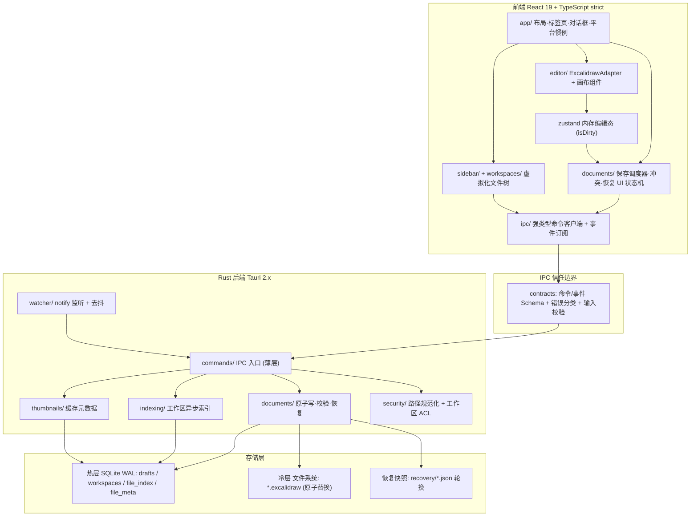
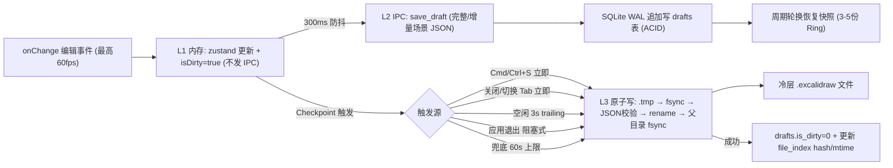
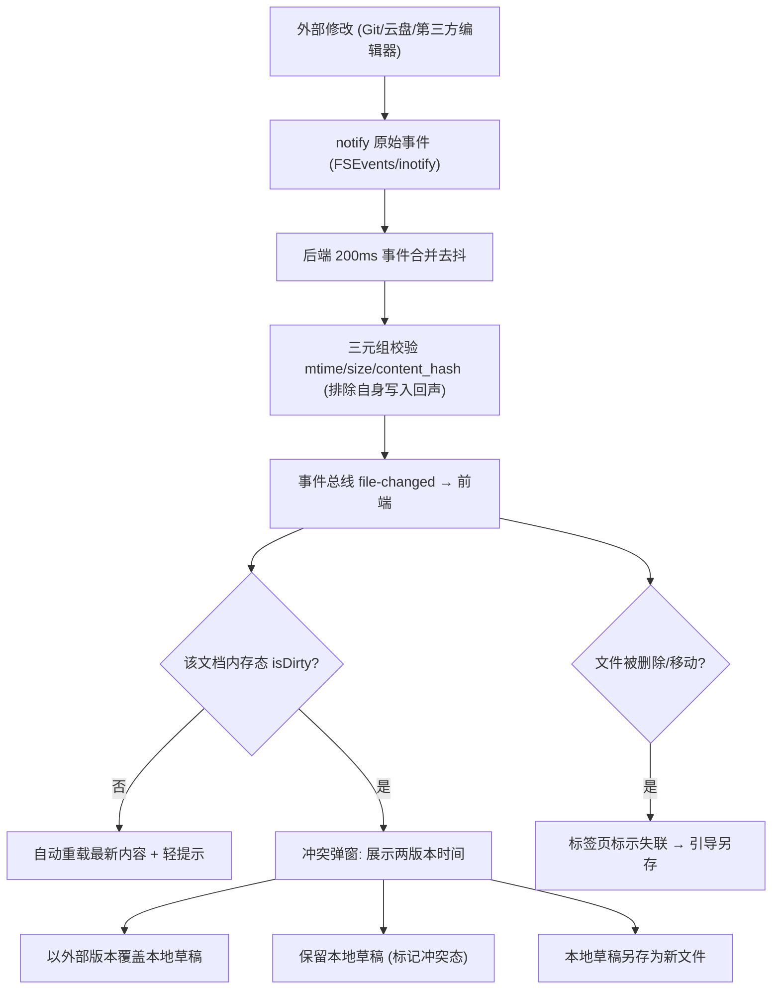

# Implementation Plan: 跨平台 Excalidraw Desktop 应用

**Branch**: `001-excalidraw-desktop` | **Date**: 2026-08-04 | **Spec**: [spec.md](./spec.md)

**Input**: Feature specification from `specs/001-excalidraw-desktop/spec.md`

> 本计划取代 `specs/0002.plan.md`（其锚定的上游规格 `0001.spec.md` 已非权威版本）。旧计划保留作历史参考。
> 技术论证依据：[specs/Cross-platform-Excalidraw-desktop-deep-research.md](../Cross-platform-Excalidraw-desktop-deep-research.md)；完整决策记录见 [research.md](./research.md)。

## Summary

构建本地优先、离线可用的跨平台（macOS + Linux）Excalidraw 桌面应用。核心技术路线：Tauri 2.x（Rust 后端 + 系统 WebView）承载 React 19 + TypeScript strict 前端，官方 `@excalidraw/excalidraw` 以 npm 依赖方式集成（非 Fork）；持久化采用"热层 SQLite（WAL）草稿 + 冷层标准 `.excalidraw` 文件原子写"的双层架构，配合会话锁 + 多版本轮换快照实现崩溃恢复；`notify` 文件监听 + 三元组（mtime/size/hash）乐观并发实现外部变更感知与冲突消解。质量保证以 Playwright 桌面 E2E 与故障注入测试为中心。

## Technical Context

**Language/Version**: Rust 1.80+（后端）、TypeScript 5.x strict（前端，现有 `typescript ~6.0.3` 待随依赖锁定核准）、React 19

**Primary Dependencies**: Tauri 2.x、`@excalidraw/excalidraw`（npm 正式版锁定）、rusqlite（bundled SQLite，WAL）、notify、tokio、zustand、@tanstack/react-virtual（完整清单见下文"第三方依赖清单"）

**Storage**: 双层——热层 SQLite（WAL 模式：drafts/workspaces/file_index/file_meta 表）+ 冷层标准 `.excalidraw` JSON 文件（`.tmp` + fsync + POSIX rename 原子替换）；恢复快照为应用数据目录下的轮换 JSON 文件

**Testing**: 前端 Vitest + React Testing Library；后端 `cargo test` + clippy；浏览器可见 UI 使用 Playwright；Tauri 进程级桌面套件使用 `APP_E2E=1` 测试构建与故障注入；平台打包/IME/文件关联使用 macOS/Linux 真机矩阵。三类证据 MUST 分开报告，浏览器覆盖不得替代原生壳或故障注入验证。

**Target Platform**: macOS 12+（Apple Silicon + Intel，Universal Binary）；Linux（Ubuntu/Debian、Fedora；X11 + Wayland；WebKitGTK）

**Project Type**: desktop-app（Tauri：`src/` 前端 + `src-tauri/` Rust 后端）

**Performance Goals**: 对齐 spec Success Criteria——固定 Apple M1 / 8GB 参考机冷启动 P95 ≤2s（SC-002）；10,000+ 图元平移/缩放 ≥30fps 目标 60fps、编辑无 >100ms 冻结（SC-005）；高频绘制期磁盘写入次数 ≤编辑事件数 1%（SC-006）；万级文件侧边栏滚动 ≥50fps（SC-007）；空闲 CPU、10k 场景 RSS、30 分钟内存增长与静置写盘满足 SC-013。

**Constraints**: 固定参考机应用进程树空载 RSS P95 ≤150MB、空闲 CPU P95 ≤单逻辑核 1%、10k 场景 RSS ≤350MB、30 分钟 RSS 增长同时 ≤50MB 且 ≤15%、静置 60s 零持续写入（SC-002/013）；完全离线运行（SC-001）；保存中断文件损坏率 0（SC-003）；崩溃恢复窗口 ≤5s（SC-004）；外部变更 3s 内感知、零静默覆盖（SC-008）

**Scale/Scope**: 单用户；单实例多标签；工作区可含 10,000+ 文件；单文档 10,000+ 图元；7 个用户故事、33 条功能需求

## Constitution Check

*GATE: Must pass before Phase 0 research. Re-check after Phase 1 design.*

对照宪法 v1.2.0（`.specify/memory/constitution.md`）：

| 宪法条款 | 本计划符合性 | 说明 |
|---------|------------|------|
| I. 代码质量（SOLID/DRY、单一权威层、TS strict、Rust 禁 unwrap） | PASS（设计层面） | 领域不变量集中于 Rust 后端（原子写、路径校验、冲突判定）；前端仅持编辑态；IPC 契约强类型（contracts/）；`tsconfig.json` 已 strict；lint/clippy 门禁列入 Phase 1 Setup |
| II. 测试标准（桌面 E2E 优先 + 故障注入） | PASS（设计层面） | 测试分层与三类必测故障场景已进入本计划与 quickstart；E2E 骨架为 Phase 1 Setup / Phase 2 Foundational 交付物，先于首个功能 PR |
| III. UX 一致性（跨平台一致、可访问性、状态完备） | PASS | spec FR/Edge Cases 已覆盖冲突/离线/错误状态；平台惯例差异（快捷键修饰键等）在模块划分 app/ 层集中处理；a11y 最低线随各用户故事任务交付 |
| IV. 性能预算（SC 红线、固定参考机、削峰、测量数据） | PASS | Technical Context 引用 SC 数值为预算；T089/T091 在 Foundational 建立固定机测量基础设施与硬门禁，T090/T108 在 US1 Checkpoint 前执行首次 SC 硬验收与 soak；高频路径设计禁止逐事件 IPC（数据流图 1） |
| V. 文档规范 + 架构图标准（Mermaid 分层图/数据流图） | PASS | 本文件含 Mermaid 分层图 1 幅、数据流图 2 幅；ADR 决策记录于 research.md；`docs/` 目录随实现阶段建立 |
| 文档代码同步门禁 | PASS | 本次为纯文档交付；实现阶段起 PR 检查清单执行同步项 |

**存量缺口（非本计划豁免项，列为实施前置清偿任务，进入 tasks.md Phase 1 Setup / Phase 2 Foundational）**：

1. `src-tauri/tauri.conf.json` 的 `"csp": null` 必须替换为严格 CSP（违反宪法安全条款与 FR-033）。
2. 仓库无任何测试基建（vitest/cargo test/Playwright 均未配置），须在首个功能任务前建立。
3. `package.json` 缺 lint/format/typecheck/test 脚本与 CI 门禁。
4. `AGENTS.md` Commands 章节与实际命令不同步，须随 Phase 1 Setup 更新。

## 技术栈与架构决策（对比与决策过程）

> 完整的 Decision / Rationale / Alternatives 记录见 [research.md](./research.md)，此处保留结论与关键权衡。

### D1. 桌面框架：Tauri 2.x（选定） vs Electron

| 维度 | Tauri 2.x（选定） | Electron |
|------|------------------|----------|
| 安装包体积 | 约 10–25MB | 约 80–200MB |
| 空载内存 | 约 30–80MB（预算 ≤150MB 有充裕余量） | 120–400MB（直接击穿 SC-002） |
| 冷启动 | <1s（预算 ≤2s） | 1–3s |
| 渲染一致性 | WKWebView vs WebKitGTK 存在差异，需跨发行版验证 | Chromium 完全一致 |
| 安全模型 | Rust 边界 + 细粒度 Capabilities，默认无 Node 暴露 | 需手工配置 Context Isolation |
| 后端能力 | Rust 原生：原子写、SQLite、notify 监听高效可靠 | Node.js + native 模块 |

**决策**：Tauri 2.x。SC-002 的内存/启动预算实质上排除了 Electron；可靠性核心（原子写、故障恢复）天然适合 Rust 实现。代价是 Linux WebKitGTK 兼容性风险，以 Phase 10 / T094 跨发行版验证矩阵对冲（Wayland/X11 × 主流发行版 × Fcitx5/IBus IME）。

### D2. 热层存储：SQLite WAL（选定，先行） vs redb

| 维度 | SQLite WAL（选定） | redb |
|------|-------------------|------|
| 写入模型 | WAL 顺序追加，单事务 ACID | 纯 Rust KV，MVCC |
| 生态与工具 | 成熟（rusqlite bundled、CLI 可检修、迁移工具链完整） | 较新，运维工具少 |
| 查询能力 | SQL：file_index/file_meta 的索引查询、JOIN 直接支持 | KV 需自建二级索引 |
| 依赖形态 | C 库（bundled 编译，无系统依赖） | 纯 Rust |

**决策（用户已确认）**：SQLite WAL 先行，承载 drafts、workspaces、file_index、file_meta 全部热层数据。**redb 重构触发条件**（满足任一且经实测数据支持时才启动评估，记录为 ADR）：

1. WAL 在目标硬件实测出现无法通过 `synchronous`/checkpoint 调优解决的写放大或尾延迟超标（草稿写 P99 > 50ms）；
2. 单连接锁竞争在多文档并发场景实测阻塞 UI 关键路径；
3. bundled SQLite 在某个目标平台产生无法接受的构建/分发问题。

接口层以仓储模式（`database/` 模块 trait 边界）隔离存储实现，保证重构仅替换实现层。

### D3. Excalidraw 集成：npm 依赖 + 适配层（选定） vs Fork 上游 app

**决策**：`@excalidraw/excalidraw` 作为锁定版本的 npm 依赖，业务代码只经 `ExcalidrawAdapter` 访问官方 API，屏蔽上游 breaking changes。Fork 方案（ImGajeed76 路线）被否决：上游同步成本与安全补丁滞后不可接受。字体/Worker 等静态资源构建期拷贝至 `public/fonts/`，入口注入 `window.EXCALIDRAW_ASSET_PATH`，保证完全离线（FR-004/SC-001）。

### D4. Rust SQLite 绑定：rusqlite（选定） vs sqlx

**决策**：rusqlite（`bundled` feature）。同步 API 配合专用写线程 + 队列即可满足热层吞吐；sqlx 的 async/编译期 SQL 校验对嵌入式单文件库收益低，且引入更重的依赖面。数据库操作统一在 Tokio `spawn_blocking`/专用线程执行，不阻塞 IPC 处理。

### D5. 其余关键决策（结论）

| 决策点 | 结论 | 备选（被否原因） |
|--------|------|-----------------|
| 文件监听 | `notify` crate（FSEvents/inotify）+ 200ms 后端合并去抖 | 前端轮询（CPU 浪费、延迟大） |
| 冷层落盘 | `.tmp` 同卷写入 → fsync → JSON 校验 → rename → 父目录 fsync | 直接覆盖写（半写损坏，违反 SC-003） |
| 前端状态 | zustand（编辑态/标签页/脏标记） | Redux（样板重）、Context（高频更新性能差） |
| 列表虚拟化 | @tanstack/react-virtual | react-window（维护活跃度与 API 灵活性略逊，二者皆可，选前者） |
| CJK 字体 | 构建期 fonttools 合并 Virgil/Excalifont + 小赖字体 → `Virgil-CJK.woff2` | 运行时字体回退（破坏手绘风格，FR-004 不满足） |
| 缩略图 | 前端 Web Worker + OffscreenCanvas 懒生成，WebP 存磁盘缓存 + SQLite 元数据，内容寻址键 | 后端 Rust 渲染（需复刻 rough.js 渲染，成本过高） |
| 单实例/文件关联 | tauri-plugin-single-instance + 平台声明（CFBundleDocumentTypes / MIME + .desktop） | 无（FR-028 直接要求） |
| 测试分层 | Playwright 浏览器 UI + `APP_E2E=1` Tauri 进程级 Harness + macOS/Linux 真机矩阵 | 单一浏览器套件（无法证明原生壳与文件系统可靠性） |
| 性能门禁 | Apple M1 / 8GB 固定 runner 硬门禁；聚合 Tauri/WebView/GPU 进程树；Intel/Linux 非阻断趋势 | GitHub 托管机绝对阈值（硬件噪声不可控） |

### D6. 性能证据与故障注入边界

性能报告必须记录 schema 版本、commit、硬件型号、内存、准确的 OS/WebView 版本、样本、统计量、预算与 verdict，且不得包含机器唯一标识或秘密。绝对预算仅在标签为 `self-hosted`、`macOS`、`ARM64`、`excalidraw-perf` 的固定 Apple M1 / 8GB runner 上阻断合并；runner 硬件、OS 或 WebView 改变时，原基线失效，须以测量证据和 ADR 显式重建。

`APP_E2E=1` Harness 仅允许测试构建编译和注册，生产构建必须不存在该接口。原子写故障枚举固定为 `temp_created`、`mid_write`、`temp_synced`、`json_validated`、`before_rename`、`after_rename`、`before_parent_sync`、`parent_synced`。每个 PR 确定性覆盖全部八点，固定机夜间任务额外运行 100 个记录 seed 的随机故障用例。

## 架构设计

### 分层图（Layered View）



依赖方向自上而下单向；前端不直接触达文件系统或数据库；所有路径进入后端后先经 `security/` 规范化并校验工作区白名单（FR-031）。

### 数据流图 1：编辑 → 草稿 → 落盘（三级削峰）



### 数据流图 2：外部变更 → 冲突消解



## Project Structure

### Documentation (this feature)

```text
specs/001-excalidraw-desktop/
├── spec.md              # 权威 PRD（原 0001-spec-claude.md）
├── plan.md              # 本文件
├── research.md          # Phase 0 决策记录（ADR 集）
├── data-model.md        # Phase 1 实体与 SQLite schema
├── quickstart.md        # Phase 1 验证指南
├── contracts/
│   └── ipc-contracts.md # Phase 1 IPC 契约
├── checklists/
│   └── requirements.md  # spec 质量清单
└── tasks.md             # Phase 2（$speckit-tasks 生成，不属本命令）
```

### Source Code (repository root)

```text
src/                          # 前端 React 应用
├── app/                      # 布局、标签页、全局对话框、菜单/快捷键（平台惯例集中层）
├── editor/                   # ExcalidrawAdapter.ts / ExcalidrawEditor.tsx /
│                             # sceneSerializer.ts / exportService.ts /
│                             # fontLoader.ts（EXCALIDRAW_ASSET_PATH 与字体注册）/
│                             # imeBridge.ts（CJK IME 候选框坐标同步，FR-005）
├── documents/                # documentStore.ts / draftScheduler.ts（三级削峰状态机）/
│                             # conflictDetector.ts / recoveryManager.ts
├── sidebar/                  # 虚拟化文件树、缩略图请求队列（Web Worker）
├── workspaces/               # 工作区挂载/移除 UI 与状态
└── ipc/                      # 强类型命令绑定 + 事件订阅（contracts 的 TS 侧）

src-tauri/                    # Rust 后端
├── src/
│   ├── commands/             # IPC 命令入口（薄层：反序列化→校验→调领域服务）
│   ├── documents/            # atomic_write.rs / recovery.rs / validation.rs
│   ├── database/             # 连接池、写线程、迁移、仓储 trait（隔离 SQLite/redb）
│   ├── indexing/             # 工作区异步扫描与增量索引
│   ├── watcher/              # notify 封装 + 去抖 + 回声抑制
│   ├── thumbnails/           # 缩略图缓存元数据与磁盘管理
│   ├── security/             # 路径规范化、工作区 ACL 白名单
│   ├── lib.rs                # 生命周期、单实例、会话锁
│   └── main.rs
├── capabilities/             # 最小权限声明（default.json 收紧）
└── migrations/               # SQLite schema 迁移

e2e/                          # 浏览器 UI、Tauri 桌面可靠性与 perf 固定机夹具（分目录）
public/fonts/                 # 离线字体（含构建期合并的 Virgil-CJK.woff2）
scripts/                      # 字体合并（fonttools）、构建辅助
docs/                         # 架构文档与 ADR（实现阶段建立）
```

**Structure Decision**: 采用 Tauri 标准双端布局（现有脚手架目录骨架保留，内容按上述模块重写）。前端按领域（editor/documents/sidebar/workspaces）而非技术类型分包；后端 `database/` 以仓储 trait 隔离存储实现以支持 D2 的 redb 备选路径。

## 第三方依赖清单

### 前端（npm）

| 依赖 | 用途 | 备注 |
|------|------|------|
| `@excalidraw/excalidraw` | 画布编辑器核心 | 锁定正式版本；MIT |
| `react` / `react-dom` 19 | UI 框架 | 已有 |
| `zustand` | 内存编辑态 | MIT，轻量 |
| `@tanstack/react-virtual` | 文件树虚拟滚动 | MIT |
| `@tauri-apps/api` + `plugin-dialog` / `plugin-fs`（受限 scope） | IPC 与系统对话框 | 权限最小化 |
| dev: `vitest`、`@testing-library/react`、`eslint`、`prettier`、`@playwright/test` | 测试与质量门禁 | Phase 1 Setup 落地 |

### 后端（Cargo）

| 依赖 | 用途 | 备注 |
|------|------|------|
| `tauri` 2.x | 应用框架 | MIT/Apache-2.0 |
| `tauri-plugin-single-instance` | 单实例（FR-028） | 二次启动转发参数 |
| `rusqlite`（bundled） | 热层 SQLite | 无系统依赖 |
| `notify` | 文件监听（FR-018） | FSEvents/inotify |
| `tokio` | 异步运行时（索引/监听/写线程） | |
| `serde` / `serde_json` | 契约序列化与 JSON 校验 | |
| `thiserror` | 错误分类（契约错误枚举） | |
| `sha2` | 内容哈希（冲突三元组、资产去重、缓存键） | |
| `uuid` | 文档/快照标识 | |
| `trash` | 文件删除进系统回收站（FR-016，非物理删除） | MIT/Apache-2.0；跨平台回收站 API |

### 构建期工具

| 工具 | 用途 |
|------|------|
| Python `fonttools` | Virgil/Excalifont 与小赖字体（SIL OFL，可再分发）合并为 Virgil-CJK |
| Tauri CLI + macOS `codesign`/`notarytool`、Linux AppImage/deb/rpm 打包 | 分发流水线（FR-029） |

## Complexity Tracking

> 无需要豁免的宪法违规项。双层持久化与仓储抽象由 spec 可靠性需求（FR-008~014）直接驱动，非投机复杂度；redb 备选仅保留触发条件，不预先实现。

## Constitution Check（Phase 1 设计后复评）

设计工件（research.md、data-model.md、contracts/、quickstart.md）完成后复评：**PASS**。

- 架构图标准：本文件含 Mermaid 分层图与两幅数据流图，覆盖宪法要求的最低集合。
- 单一权威层：数据模型与校验规则唯一定义于 data-model.md 并由 Rust 侧实现，contracts 仅描述边界形状，无业务规则重复。
- E2E 与故障注入：quickstart.md 将三类必测故障场景映射为可执行验证入口。
- 性能与资源：T089/T091 在 Foundational 建立固定机测量基础设施与门禁；因画布尚未实现，Phase 2 只记录 scaffold 诊断结果，不作 SC verdict。T090/T108 在 US1 Checkpoint 前执行首次完整硬验收与长时基线，后续性能敏感 PR 必须附带同机前后对比。
- 无新增未证成复杂度；Complexity Tracking 保持为空。
