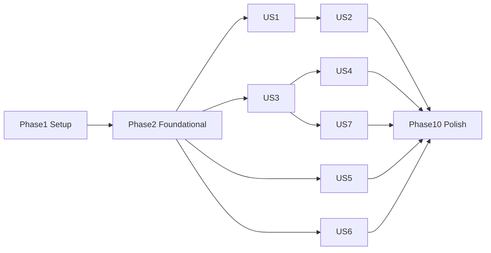

# Tasks: 跨平台 Excalidraw Desktop 应用

**Input**: Design documents from `specs/001-excalidraw-desktop/`

**Prerequisites**: [plan.md](./plan.md)、[spec.md](./spec.md)、[research.md](./research.md)、[data-model.md](./data-model.md)、[contracts/ipc-contracts.md](./contracts/ipc-contracts.md)、[quickstart.md](./quickstart.md)

**Tests**: 包含。宪法原则 II 强制桌面 E2E 优先与三类故障注入必测（SC-003/012）；可靠性路径测试先于实现编写并确认失败后再实现。

**Organization**: 任务按用户故事分组，每个故事可独立实现、独立测试、独立交付。

## Format: `[ID] [P?] [Story] Description`

- **[P]**: 可并行（不同文件、无未完成依赖）
- **[Story]**: 所属用户故事（US1–US7，对应 spec.md 优先级 P1–P3）
- 每个任务附精确文件路径

## Path Conventions

Tauri 双端布局（plan.md Project Structure）：前端 `src/`，后端 `src-tauri/src/`，E2E `e2e/`，构建脚本 `scripts/`，SQLite 迁移 `src-tauri/migrations/`。

## Agent Routing

The following names describe logical capability roles for planning and review. They do not require shared `.codex/agents/` files; contributors may map the roles to their preferred local agents or engineering workflow.

| 工作轨道 | 主责 agent | 验收/协作边界 |
|---------|------------|---------------|
| Tauri IPC、Capabilities/CSP、生命周期 | `tauri-dev` | Rust 内部交给 `rust-expert`；平台差异交给 `desktop-platform-dev` |
| Rust 持久化、SQLite、索引、监听、并发 | `rust-expert` | 进程级故障证据由 `desktop-reliability-tester` 提供 |
| React、Excalidraw、虚拟列表、a11y | `ui-dev` | 浏览器 UI E2E 由 `e2e-tester`；性能 verdict 由 `performance-engineer` |
| 普通且契约已定的跨层故事 | `fullstack-developer` | 不承接核心 IPC、可靠性、平台或性能门禁 |
| CPU/RSS/FPS/IPC/磁盘与 soak | `performance-engineer` | 只负责测量、profiling、基线和 verdict；修复回到所属实现 agent |
| SIGKILL、原子写、恢复、冲突、磁盘故障 | `desktop-reliability-tester` | Harness 仅测试构建；产品修复回到所属实现 agent |
| macOS/Linux 原生集成与 US6 | `desktop-platform-dev` | `tauri-dev` 审查共享 Tauri 契约；Windows 不在范围内 |
| 跨 Rust/TS/IPC Checkpoint 审查 | `fs-reviewer` | `code-reviewer` 仅用于小型单层 diff |

仅在存在至少两个相互独立且文件不重叠的轨道时并行委派；同一文件的任务严格串行，主 agent 负责契约整合与最终验证。

---

## Phase 1: Setup (Shared Infrastructure)

**Purpose**: 依赖锁定、目录骨架、质量门禁脚本与存量安全缺口清偿

- [X] T001 安装并锁定前端依赖（`@excalidraw/excalidraw` 正式版、`zustand`、`@tanstack/react-virtual`、`@tauri-apps/plugin-dialog`）于 package.json，锁定 pnpm 为唯一包管理器（packageManager 字段 + pnpm-lock.yaml）
- [X] T002 [P] 添加后端依赖（`rusqlite` bundled、`notify`、`tokio`、`thiserror`、`sha2`、`uuid`、`trash`、`tauri-plugin-single-instance`）于 src-tauri/Cargo.toml
- [X] T003 [P] 配置前端质量门禁：eslint + prettier + `lint`/`typecheck`/`test`/`e2e` scripts 于 package.json、eslint.config.js、.prettierrc
- [X] T004 [P] 建立目录骨架：src/{app,editor,documents,sidebar,workspaces,ipc}/、src/app/theme/、src-tauri/src/{commands,documents,database,indexing,watcher,thumbnails,security}/、e2e/、scripts/、docs/（各含占位 mod/index 文件）
- [X] T005 [P] 实现字体合并管线 scripts/build-fonts.py（fonttools：Virgil/Excalifont + 小赖字体 → public/fonts/Virgil-CJK.woff2，R10）并接入 `fonts:build` script
- [X] T006 将 src-tauri/tauri.conf.json 的 `"csp": null` 替换为严格 CSP（`default-src 'self'; script-src 'self'; style-src 'self' 'unsafe-inline'; img-src 'self' asset: blob: data:`，R13，宪法存量缺口 1）
- [X] T007 [P] 收紧 src-tauri/capabilities/default.json 为最小权限集（core:default + 受限 dialog，随功能增量追加）
- [X] T008 更新 AGENTS.md 的 Commands and Validation 章节为 T003 落地后的实际命令（pnpm lint/typecheck/test/e2e、cargo fmt/clippy/test，宪法存量缺口 4；依赖 T003）

---

## Phase 2: Foundational (Blocking Prerequisites)

**Purpose**: 全部用户故事共同依赖的核心基建

**⚠️ CRITICAL**: 本阶段完成前不得开始任何用户故事

- [X] T009 实现路径安全模块 src-tauri/src/security/mod.rs（canonicalize + 工作区白名单前缀校验 + 符号链接逃逸拦截，FR-031）
- [X] T010 [P] 实现 SQLite 迁移框架 src-tauri/src/database/migrations.rs（事务化应用、PRAGMA user_version、失败拒绝启动）与 src-tauri/migrations/0001_init.sql（workspaces/file_index/drafts/file_meta 四表 + PRAGMA 基线，data-model §2）
- [X] T011 定义仓储 trait 与 SQLite 实现 src-tauri/src/database/repository.rs（drafts/workspaces/file_index/file_meta 访问接口，隔离存储实现，R2）
- [X] T012 实现数据库专用写线程与队列 src-tauri/src/database/writer.rs（spawn_blocking 队列化，R4）
- [X] T013 编写原子写并发单测 src-tauri/src/documents/atomic_write_test.rs（覆盖 `temp_created`/`mid_write`/`temp_synced`/`json_validated`/`before_rename`/`after_rename`/`before_parent_sync`/`parent_synced` 八个中断点、残留 `.tmp` 清理与并发 rename 安全——先写测试，确认失败）
- [X] T014 实现原子写流水线 src-tauri/src/documents/atomic_write.rs（六个逻辑阶段：同卷 `.tmp` 写入、临时文件 fsync、JSON 校验、rename、父目录 fsync、异常清理；必须暴露并覆盖八个 `AtomicWriteFaultPoint`，R5）
- [X] T015 [P] 定义统一错误枚举 src-tauri/src/commands/error.rs（thiserror，12 个 ErrorCode 映射 IpcError 形状，contracts §0）
- [X] T016 [P] 建立 TS 契约文件 src/ipc/contracts.ts（IPC_CONTRACT_VERSION=1、全部命令/事件/错误类型，contracts §0–2）
- [X] T017 建立 Rust DTO src-tauri/src/commands/dto.rs（serde camelCase，与 contracts.ts 字段一致）
- [X] T018 实现 `app_handshake` 命令 src-tauri/src/commands/session.rs 与会话锁 src-tauri/src/documents/session_lock.rs（session.lock 创建/清理/异常判定，data-model SessionLock）
- [X] T019 [P] 配置 Vitest + React Testing Library（vitest.config.ts、src/test-setup.ts）与首个冒烟测试
- [X] T020 [P] 配置测试分层骨架：Playwright 浏览器 UI 配置 + Tauri 进程级桌面 fixture 于 e2e/playwright.config.ts、e2e/helpers/app.ts（启动/关闭隔离的 Tauri 测试构建；明确浏览器与原生壳证据边界）
- [X] T109 [P] 为主题解析器编写单元测试 src/app/theme/themeController.test.ts：覆盖 light/dark/system 初始解析、system 运行时变化、手动模式忽略系统变化、版本化偏好恢复与损坏值回退（FR-035/036，先写并确认失败；依赖 T019）
- [X] T110 实现主题基础设施 src/app/theme/types.ts、src/app/theme/themeRegistry.ts、src/app/theme/themeController.ts、src/app/theme/tokens.css 与 src/main.tsx：第一版仅注册 `excalidraw` 家族，偏好分离 `themeId`/`modePreference`，启动前设置解析后的明暗模式并统一驱动语义 token（FR-035~037、R19；依赖 T109）
- [X] T021 实现 `APP_E2E=1` 故障注入 Harness：src-tauri/src/e2e_harness.rs + e2e/helpers/fault.ts，固定 `AtomicWriteFaultPoint` 为 `temp_created`/`mid_write`/`temp_synced`/`json_validated`/`before_rename`/`after_rename`/`before_parent_sync`/`parent_synced`，另含快照破坏接口；仅测试构建编译和注册，并增加生产构建接口缺失断言
- [X] T022 [P] 建立 zustand store 骨架 src/app/store.ts（文档标签 registry、isDirty 标记、活动 Tab）与桌面壳层 src/app/AppShell.tsx、src/app/TabBar.tsx：系统原生窗口内容区固定为顶部标签、左侧文件管理区域、右侧画布；未挂载工作区时提供连接 T034 新建/打开流程的明确空状态，不实现 PWA/浏览器顶栏或范围外服务入口（FR-034、DESIGN.md）
- [X] T089 实现固定机性能测量基础设施 e2e/perf/helpers/processMetrics.ts + e2e/perf/startup-idle.spec.ts：支持聚合 Tauri/WebView/GPU 进程树、清空测试数据、冷启动重复采样、稳定/采样窗口和应用管理路径写入观察；输出含 schemaVersion/commit/hardware/memory/osVersion/webviewVersion/samples/statistic/budget/verdict 且无机器唯一标识的 JSON 报告。Phase 2 仅对 scaffold 运行诊断基线，不对“画布可编辑”作 SC verdict；SC-002/013 首次硬验收在 T090 完成（依赖 T020）
- [X] T091 配置固定性能 runner 硬门禁 .github/workflows/performance.yml：仅标签 `self-hosted`/`macOS`/`ARM64`/`excalidraw-perf` 执行绝对预算并阻止合并，归档报告；Intel Mac/Linux 仅非阻断趋势；环境变化必须失败并要求 ADR 重建基线（依赖 T089）

**Checkpoint**: 基建就绪——用户故事可开始（US1 建议先行）

---

## Phase 3: User Story 1 - 离线创建、编辑与保存本地图纸 (Priority: P1) 🎯 MVP

**Goal**: 完全离线环境下新建/绘制（含中文手绘字体、图片）/手动+自动保存/重开一致，文件与官方格式互通

**Independent Test**: 断网完成"新建 → 绘制 → 保存 → 关闭 → 重开 → 内容一致 → 官方网页版打开兼容"闭环（quickstart US1）

### Tests for User Story 1

- [X] T023 [P] [US1] 契约测试 doc_open/doc_save_draft/doc_checkpoint/doc_close 四类用例（合法/越界路径/非法 JSON/超限）于 src-tauri/tests/contract_documents.rs（先写并确认失败）
- [X] T024 [P] [US1] draftScheduler 三级削峰状态机单测 src/documents/draftScheduler.test.ts（300ms 防抖、5 类 Checkpoint 触发、Conflicted 禁写）
- [X] T106 [P] [US1] 不可信输入对抗测试 src-tauri/tests/untrusted_scene.rs——恶意 scene fixture（嵌入脚本字段、越权路径引用、超大/畸形 JSON），断言 `FILE_CORRUPTED`/`INVALID_SCENE`/`PATH_ACCESS_DENIED` 且无副作用文件写入（FR-032；先写并确认失败）
- [X] T111 [P] [US1] 编写外观 E2E 与视觉基线 e2e/tests/us1-appearance.spec.ts：覆盖 light/dark/system、运行中系统变化、重启恢复、损坏偏好回退、壳层/画布同步、首帧无相反主题闪现及浅色/深色截图差异阈值（FR-034~037、SC-014；依赖 T020）

### Implementation for User Story 1

- [X] T025 [P] [US1] 实现 scene 结构校验 src-tauri/src/documents/validation.rs（type/version/elements 校验、256MB 上限、FILE_CORRUPTED/FILE_TOO_LARGE 错误态）
- [X] T026 [US1] 实现文档命令 src-tauri/src/commands/documents.rs：`doc_open`（含 hasNewerDraft 判定）/`doc_save_draft`（WAL 写 drafts 表）/`doc_checkpoint`（原子写 + is_dirty=0 + base_hash 更新）/`doc_close`（contracts §1.3）
- [X] T027 [P] [US1] 实现 ExcalidrawAdapter src/editor/ExcalidrawAdapter.ts（隔离官方 API：场景读写、onChange 订阅、只读切换）
- [X] T028 [US1] 实现画布组件 src/editor/ExcalidrawEditor.tsx（挂载 Adapter、注入 onChange → store isDirty，并将 T110 解析后的 `light | dark` 传入官方主题接口，使画布与壳层同步）
- [X] T029 [P] [US1] 离线资源接入：`src/editor/fontLoader.ts` 注册字体 + 入口注入 `window.EXCALIDRAW_ASSET_PATH="/fonts/"`（src/main.tsx）+ 构建期拷贝官方字体与 Virgil-CJK 产物至 public/fonts/（vite.config.ts / scripts）
- [X] T030 [P] [US1] 实现场景序列化器 src/editor/sceneSerializer.ts（scene ↔ 标准 .excalidraw JSON、序列化往返测试）
- [X] T031 [US1] 实现三级削峰保存调度器 src/documents/draftScheduler.ts（L1 内存标记 → L2 300ms 防抖 save_draft → L3 Checkpoint：手动 S/切 Tab/空闲 3s/退出阻塞/60s 兜底，plan 数据流图 1）
- [X] T032 [US1] 实现文档会话 store src/documents/documentStore.ts（打开/关闭/切换、base_hash 跟踪、与 draftScheduler 联动）
- [X] T033 [US1] 保存状态 UI：未保存标识 + Cmd/Ctrl+S 快捷键 + 菜单项于 src/app/（TabBar 徽标 + 快捷键注册）
- [X] T034 [US1] 新建/打开文件对话框流程 src/app/fileDialogs.ts（tauri dialog + doc_open 接线；US3 之前以系统对话框为唯一入口）
- [X] T112 [US1] 实现外观选择控件 src/app/AppearanceControl.tsx 并接入 src/app/AppShell.tsx：提供浅色/深色/跟随系统三项、可访问选中状态与键盘操作，调用 T110 主题控制器且不写入文档状态（FR-035~037；使 T111 通过）
- [X] T103 [P] [US1] 实现画布 IME 桥接 src/editor/imeBridge.ts（Excalidraw 隐形 textarea 绝对坐标随缩放/平移同步，FR-005 / R16）
- [X] T104 [US1] Linux 启动入口按需设置 `GTK_IM_MODULE`（及 Wayland 相关修正）于 src-tauri/src/lib.rs，与 imeBridge 联调（FR-005）
- [X] T035 [US1] E2E：离线全流程 e2e/tests/us1-offline-edit-save.spec.ts（断网 fixture、绘制中文文本、保存重开一致、零外部网络请求断言）
- [X] T036 [US1] E2E：官方格式兼容 e2e/tests/us1-format-compat.spec.ts（保存文件 JSON schema 断言 type/version/elements + 官方 dist 解析器加载验证，FR-002）
- [X] T105 [US1] E2E：多文档并发持久化 e2e/tests/us1-concurrent-tabs-save.spec.ts——同时打开 ≥2 文档并编辑，断言各文档 checkpoint 独立完成、UI 无互相阻塞、文件内容互不串写（FR-014）
- [X] T107 [US1] E2E/故障注入：模拟磁盘满/`DISK_FULL` e2e/tests/us1-disk-full.spec.ts——断言原文件完好、草稿仍可恢复、UI 有明确错误（Edge Case）
- [ ] T090 [US1] 性能硬验收 e2e/perf/startup-idle.spec.ts + e2e/perf/canvas-io.spec.ts：清空测试数据后冷启动 10 次验证至画布可编辑 P95 ≤2s，稳定 30s 后 60s 窗口验证空载进程树 RSS P95 ≤150MB；固定 10k 图元 fixture 验证平移/缩放 ≥30fps、编辑无 >100ms 冻结、稳定后 RSS ≤350MB；持续绘制 60s 验证写次数 ≤事件数 1% 且无持久化掉帧尖峰（SC-002/005/006/013；依赖 T028/T031/T089）
- [ ] T108 [US1] 长时资源稳定性夹具 e2e/perf/edit-soak.spec.ts：热身后脚本编辑 30min，RSS 增长同时 ≤50MB 且 ≤15%；随后静置 60s，CPU P95 ≤单逻辑核 1% 且应用管理的数据目录/工作区零持续写入（SC-013；依赖 T090）
- [X] T097 [US1] a11y 最低线：桌面壳层、标签页、保存状态、快捷键、外观选择与文件对话框具备语义结构、accessible name、非颜色唯一状态、可见焦点、WCAG 2.2 AA 适用对比度与 reduced motion，于 src/app/AppShell.tsx、src/app/TabBar.tsx、src/app/AppearanceControl.tsx、src/app/fileDialogs.ts（FR-038、SC-015、宪法原则 III、DESIGN.md）

**Checkpoint**: US1 独立可交付（MVP）——离线编辑器 + 可靠保存闭环

---

## Phase 4: User Story 2 - 异常退出后不丢失编辑成果 (Priority: P1)

**Goal**: 崩溃/强杀/断电后：文件零损坏，草稿可恢复（≤5s 窗口），恢复对话框引导决策

**Independent Test**: 故障注入——编辑中强杀与保存中断后重启，验证原文件完好 + 恢复弹窗内容一致（quickstart US2）

### Tests for User Story 2

- [ ] T037 [P] [US2] 参数化故障注入 E2E e2e/tests/us2-kill-during-save.spec.ts：对 T021 八个 `AtomicWriteFaultPoint` 逐点 SIGKILL，重启后断言目标文件为可解析的完整旧/新版本、无静默覆盖且恢复 UI 正确；PR 确定性覆盖全部八点，固定机夜间 workflow 额外运行并记录 100 个随机 seed（SC-003/012——先写并确认失败）
- [ ] T038 [P] [US2] 恢复快照轮换与自损回退单测 src-tauri/src/documents/recovery_test.rs（Ring 覆盖、损坏跳过取次新）

### Implementation for User Story 2

- [ ] T039 [US2] 实现轮换恢复快照 src-tauri/src/documents/recovery.rs（recovery/<sha256(path)>/recovery-001..005.json Ring 写入、含 baseFileHash/savedAt 元数据，data-model RecoverySnapshot）
- [ ] T040 [US2] 草稿写入路径挂接快照周期写（draftScheduler L2 触发节点调 recovery 写入）于 src-tauri/src/commands/documents.rs
- [ ] T041 [US2] 实现恢复命令 src-tauri/src/commands/recovery.rs：`recovery_list`（快照/冷层比对判定 snapshotNewer）+ `recovery_apply`（restore/keepDisk/saveAsNew/discard 四路径，contracts §1.1）
- [ ] T042 [P] [US2] 实现恢复对话框 src/documents/RecoveryDialog.tsx（展示时间与文档、四选项、handshake abnormalExit 触发）
- [ ] T043 [US2] 实现恢复管理器 src/documents/recoveryManager.ts（启动流程接线：handshake → list → 对话框 → apply → 载入 scene）
- [ ] T044 [US2] 应用退出阻塞 Flush：窗口关闭/退出事件拦截，等待全部非 Clean 文档 checkpoint 完成（src-tauri/src/lib.rs 生命周期 Hook + documentStore 退出协议）
- [ ] T045 [US2] E2E：快照自损回退 e2e/tests/us2-snapshot-corruption.spec.ts（Harness 破坏最新快照 → 断言回退次新并提示实际时间点）
- [ ] T046 [US2] E2E：正常退出无弹窗 + 恢复窗口 ≤5s e2e/tests/us2-recovery-window.spec.ts（编辑后 5s 内强杀 → 恢复内容等于最后编辑，SC-004）
- [ ] T098 [US2] a11y 最低线：RecoveryDialog 键盘可操作（Esc/Enter）、焦点陷阱与 `aria-*`，于 src/documents/RecoveryDialog.tsx（宪法原则 III）

**Checkpoint**: US1+US2 = 可靠性承诺闭环（零损坏 + 可恢复）

---

## Phase 5: User Story 3 - 工作区文件管理侧边栏 (Priority: P2)

**Goal**: 挂载工作区目录，侧边栏树形浏览/新建/重命名/删除，多标签独立编辑

**Independent Test**: 挂载多级目录完成全部文件操作闭环 + 万级文件流畅滚动（quickstart US3）

### Tests for User Story 3

- [ ] T047 [P] [US3] 契约测试 workspace_*/dir_list/file_* 越界路径拒绝与嵌套工作区拒绝 src-tauri/tests/contract_workspace.rs（PATH_ACCESS_DENIED/WORKSPACE_OVERLAP——先写并确认失败）

### Implementation for User Story 3

- [ ] T048 [US3] 实现工作区命令 src-tauri/src/commands/workspace.rs：`workspace_add`（canonicalize + 嵌套校验 + 触发索引）/`workspace_remove`/`workspace_list`（contracts §1.2）
- [ ] T049 [US3] 实现后台索引引擎 src-tauri/src/indexing/mod.rs（tokio 异步扫描、符号链接循环防护、file_index 增量更新、index-progress 事件）
- [ ] T050 [US3] 实现 `dir_list` 懒加载命令于 src-tauri/src/commands/workspace.rs（单层目录、仅 .excalidraw/.excalidraw.json 与目录）
- [ ] T051 [US3] 实现文件操作命令 src-tauri/src/commands/files.rs：`file_create`（原子写空白文档）/`file_rename`/`file_delete`（trash crate 回收站）
- [ ] T052 [P] [US3] 实现工作区管理 UI src/workspaces/WorkspacePanel.tsx（挂载目录选择、列表、移除确认——移除不删文件文案）
- [ ] T053 [US3] 实现虚拟化文件树 src/sidebar/FileTree.tsx（@tanstack/react-virtual + 懒展开调 dir_list + 右键菜单新建/重命名/删除）
- [ ] T054 [US3] 多标签页完善 src/app/TabBar.tsx + documentStore：同文件唯一会话、每 Tab 独立撤销历史与脏标记、切换触发 L3 Checkpoint（FR-017）
- [ ] T055 [US3] 标签页跟随文件变更：重命名同步标题、删除标示失联入口（接 file-changed 事件占位，US4 完成后自动激活）于 src/documents/documentStore.ts
- [ ] T056 [P] [US3] 侧边栏文件操作单测 src/sidebar/FileTree.test.tsx（树渲染、懒加载触发、操作回调）
- [ ] T057 [US3] E2E：文件管理闭环 e2e/tests/us3-workspace-files.spec.ts（挂载/新建/重命名/删除/多标签独立性）
- [ ] T058 [US3] E2E：万级文件滚动性能 e2e/tests/us3-scale-scroll.spec.ts（fixture 生成 10k 文件、滚动帧率采样 ≥50fps、展开 ≤200ms，SC-007）
- [ ] T099 [US3] a11y 最低线：文件树键盘导航（展开/选择/右键菜单替代路径）与侧边栏 accessible name，于 src/sidebar/FileTree.tsx（宪法原则 III）

**Checkpoint**: 单工作区文件管理完整可用

---

## Phase 6: User Story 4 - 外部文件变更感知与冲突消解 (Priority: P2)

**Goal**: 外部修改 3s 内感知；无修改自动重载，有修改三选项冲突弹窗，零静默覆盖

**Independent Test**: 外部编辑器修改打开中的文件，分别验证自动重载与冲突弹窗（quickstart US4）

### Tests for User Story 4

- [ ] T059 [P] [US4] watcher 去抖与回声抑制单测 src-tauri/src/watcher/watcher_test.rs（200ms 合并、自写 hash 抑制——先写并确认失败）

### Implementation for User Story 4

- [ ] T060 [US4] 实现文件监听 src-tauri/src/watcher/mod.rs（notify 递归监听工作区根、200ms 合并去抖、三元组 mtime/size/hash 真实变更判定、自身写入回声抑制，R7）
- [ ] T061 [US4] 事件发射接线：`file-changed`/`conflict-detected` 经 app_handle.emit 推送（isDirty 文档命中时发 conflict-detected）于 src-tauri/src/watcher/mod.rs + commands/documents.rs
- [ ] T062 [US4] Conflicted 状态强制：`doc_save_draft`/`doc_checkpoint` 在冲突态返回 CONFLICT_PENDING（data-model 不变量 2）于 src-tauri/src/commands/documents.rs
- [ ] T063 [US4] 实现 `doc_resolve_conflict` 命令（takeExternal/keepLocal/saveAsNew 三路径 + base_hash 更新，contracts §1.3）于 src-tauri/src/commands/documents.rs
- [ ] T064 [P] [US4] 实现前端冲突分流 src/documents/conflictDetector.ts（file-changed → isDirty 判定 → 自动重载或弹窗，状态机 Reloaded/Conflicted 转换）+ 冲突对话框 src/documents/ConflictDialog.tsx（两版本时间展示 + 三选项）
- [ ] T065 [US4] 失联（Orphaned）处理：外部删除/移动 → 标签失联标示 + 另存引导 src/documents/documentStore.ts（FR-020，激活 T055 占位）
- [ ] T066 [US4] E2E：外部变更全场景 e2e/tests/us4-external-changes.spec.ts（无修改自动重载 3s 内、有修改弹窗且决策前零写入、删除失联另存，SC-008）
- [ ] T067 [US4] E2E：事件风暴合并 e2e/tests/us4-event-storm.spec.ts（1s 内 20 次外部写 → 无重复弹窗/重载抖动，FR-018）
- [ ] T100 [US4] a11y 最低线：ConflictDialog 键盘可操作（Esc/Enter）、焦点陷阱与 `aria-*`，于 src/documents/ConflictDialog.tsx（宪法原则 III）

**Checkpoint**: 全部 P1+P2 故事完成——核心产品可靠性与协作安全闭环

---

## Phase 7: User Story 5 - 图纸导出与分享 (Priority: P3)

**Goal**: PNG（倍率/背景）与 SVG（字体自包含）导出，失败无残留

**Independent Test**: 中英混排画布导出后在无字体设备验证视觉一致（quickstart US5）

### Implementation for User Story 5

- [ ] T068 [P] [US5] 实现导出服务 src/editor/exportService.ts（exportToBlob/exportToSvg 封装、倍率/背景/主题选项、SVG 字体内嵌确认）
- [ ] T069 [US5] 实现 `doc_export` 命令 src-tauri/src/commands/export.rs（前端产物字节 → 原子写目标路径、DISK_FULL/IO_ERROR 无残留清理，contracts §1.3）
- [ ] T070 [US5] 导出对话框 UI src/app/ExportDialog.tsx（格式/倍率/背景选择、目标路径 dialog、失败原因展示）
- [ ] T071 [US5] E2E：PNG/SVG 导出 fidelity e2e/tests/us5-export-fidelity.spec.ts——PNG 覆盖倍率与透明/纯色背景并验证固定截图一致性；SVG 断言内嵌 WOFF2、无字体回退，并以 Playwright 固定截图基线验证 `maxDiffPixelRatio <= 0.001`（SC-009，FR-026）
- [ ] T072 [US5] E2E：导出失败无残留 e2e/tests/us5-export-failure.spec.ts（只读目录 → 明确错误 + 目标目录无 .tmp/半成品，FR-027）
- [ ] T101 [US5] a11y 最低线：ExportDialog 表单控件标签与错误提示关联（aria-describedby），于 src/app/ExportDialog.tsx（宪法原则 III）

**Checkpoint**: 成果交付通道可用

---

## Phase 8: User Story 6 - 原生桌面系统集成 (Priority: P3)

**Goal**: 双击 .excalidraw 打开、单实例复用、本地 macOS 与 Linux 原生集成验证；正式 macOS 签名/公证发布属于后续版本

**Independent Test**: 运行或安装本地构建验证文件关联、二次打开复用实例、多文件连续打开；正式 macOS 签名、公证和零拦截发布不属于当前版本（quickstart US6）

### Implementation for User Story 6

- [ ] T073 [US6] 集成 tauri-plugin-single-instance：二次启动参数转发 `open-file-request` 事件 + 窗口聚焦于 src-tauri/src/lib.rs（FR-028）
- [ ] T074 [US6] 前端接线 open-file-request → 新开标签聚焦 src/app/openFileHandler.ts（含启动参数首开处理）
- [ ] T075 [P] [US6] macOS 文件关联：CFBundleDocumentTypes + 文件图标于 src-tauri/tauri.conf.json bundle.macOS 与 Info.plist 模板（.excalidraw/.excalidraw.json）
- [ ] T076 [P] [US6] Linux 文件关联：MIME `application/x-excalidraw` 定义 + .desktop 模板于 src-tauri/tauri.conf.json bundle.linux
- [ ] T077 [US6] macOS Universal Binary 构建流水线（aarch64 + x86_64 target 编译 + lipo 合并）于 CI 工作流 .github/workflows/release.yml
- [ ] T078 [US6] 当前版本 macOS 本地验证：运行未签名/未公证构建，记录本机启动、文件关联、单实例和 Gatekeeper 手动放行结果于 docs/native-verification.md；Developer ID 签名、公证与零拦截正式发布标记为后续版本 out of scope，不作为当前版本完成门禁（SC-010）
- [ ] T079 [P] [US6] Linux 打包产物：AppImage + deb + rpm 配置于 src-tauri/tauri.conf.json bundle 与 release.yml
- [ ] T080 [US6] 原生壳手动验证清单 docs/native-verification.md——当前版本覆盖 FR-030 全矩阵：画布渲染、拖放、剪贴板、IME，以及本地构建的双击关联、单实例、Gatekeeper 手动放行、各发行版安装；正式签名/公证/零拦截验证单独标记为后续版本（浏览器 E2E 不可证明项；执行结果记录矩阵）

**Checkpoint**: 当前版本本地可验证的成熟桌面应用形态；正式 macOS 签名、公证和零拦截发布已明确出范围

---

## Phase 9: User Story 7 - 多工作区与缩略图浏览 (Priority: P3)

**Goal**: 多工作区并列管理；可视区懒生成缩略图 + 内容寻址缓存；大图去重

**Independent Test**: 双工作区并列/独立移除；滚动缩略图按需生成、重启缓存命中（quickstart US7）

### Implementation for User Story 7

- [ ] T081 [US7] 多工作区并列 UI：WorkspacePanel 多分区折叠/独立移除 src/workspaces/WorkspacePanel.tsx + FileTree 多根支持 src/sidebar/FileTree.tsx
- [ ] T082 [P] [US7] 实现缩略图 Worker src/sidebar/thumbnailWorker.ts（OffscreenCanvas + exportToBlob → 320×200 WebP、并发 1–2 低优先级队列、可视区触发）
- [ ] T083 [US7] 实现缩略图 IPC 命令适配器 src-tauri/src/commands/thumbnails.rs 与领域服务 src-tauri/src/thumbnails/：`thumb_lookup`/`thumb_store`（cache/thumbnails/aa/bb/<key>.webp 磁盘布局 + file_meta 表，contracts §1.4）
- [ ] T084 [US7] 缩略图接入文件树：可视节点懒请求 + asset 协议加载 + 内容寻址键 SHA256(content+renderer_version+theme) 于 src/sidebar/FileTree.tsx（R11）
- [ ] T085 [US7] 实现图片资产去重 src-tauri/src/documents/assets.rs（SHA-256 剥离至 `.excalidraw_assets/<hash>`、文档持引用、孤儿延迟回收，R12）
- [ ] T086 [US7] 画布图片 asset 协议加载 + 导出/对外保存重组内嵌 src/editor/ExcalidrawAdapter.ts + src-tauri/src/commands/documents.rs（convertFileSrc，FR-024/FR-002 兼容）
- [ ] T087 [US7] E2E：缩略图缓存 e2e/tests/us7-thumbnails.spec.ts（懒生成、重启 thumb_lookup.hit=true 零重复生成）
- [ ] T088 [US7] E2E：资产去重 e2e/tests/us7-asset-dedup.spec.ts（10MB 图粘贴 10 次 → 文档体积增幅 ≤5%，SC-011）
- [ ] T102 [US7] a11y 最低线：缩略图/多工作区区域不剥夺键盘焦点，装饰图 `alt=""` 或 `aria-hidden`，于 src/sidebar/FileTree.tsx、src/workspaces/WorkspacePanel.tsx（宪法原则 III）

**Checkpoint**: 全部 7 个用户故事独立可验证

---

## Phase 10: Polish & Cross-Cutting Concerns

**Purpose**: 已建立性能基线的最终回归汇总、文档、可访问性与全量回归

- [ ] T092 [P] 建立 docs/adr/ 首批 ADR（从 research.md R1–R19 提炼 ADR-001 框架选型、ADR-002 双层持久化、ADR-003 SQLite-first 与 redb 触发条件、ADR-004 固定机性能门禁与重建基线规则、ADR-005 官方画布样式与可扩展主题边界）+ docs/architecture.md（迁移 plan.md Mermaid 图源，宪法原则 V）
- [ ] T093 [P] 跨故事 a11y 回归审计 + reduced motion/主题对比度抽检（依赖 T097–T102 已完成；于 src/app/ 与各对话框验证浅色/深色的键盘闭环、焦点顺序、非颜色唯一状态、WCAG 2.2 AA 适用对比度及严重/致命自动扫描问题为 0，FR-038/SC-015、宪法原则 III、DESIGN.md）
- [ ] T094 Linux IME 验证矩阵执行（验证 T103/T104 已落地）：Ubuntu GNOME + Fedora KDE × X11/Wayland × Fcitx5/IBus 中文输入候选框跟随（FR-005），结果记录 docs/native-verification.md
- [ ] T095 quickstart.md 全场景回归执行并修订文档偏差；汇总 T037/T045/T066 三类可靠性故障测试为统一阻断门禁（SC-012），汇总 T111 外观矩阵与视觉基线（SC-014）及 T097/T093 无障碍证据（SC-015），汇总 T089/T090/T108 固定机最终性能报告与 T091 硬门禁结果；记录 SC-010 为后续版本 out of scope（宪法文档同步门禁终审）
- [ ] T096 [P] 补充 README.md（安装、开发、构建、贡献指引与文档索引）

---

## Dependencies & Execution Order

### Phase Dependencies

- **Phase 1 → Phase 2**：T001/T002（依赖声明）先于全部 Foundational 编码
- **Phase 2 BLOCKS 一切用户故事**：T009（security）、T014（atomic_write）、T015–T017（契约）、T018（会话锁）、T020/T089/T091（测试与固定机性能基础设施）、T109/T110（主题解析测试与基础设施）为多故事共同前置
- **用户故事顺序**：US1 → US2 强依赖（恢复建立在草稿链路上）；US3–US7 在 Phase 2 后可并行，但 US4 依赖 US3 的工作区监听根、US7 依赖 US3 的文件树
- **Phase 10** 依赖全部所需故事完成；性能基础设施在 Phase 2 建立，大场景与 soak 在 US1 Checkpoint 前由 T090/T108 建立，Phase 10 仅汇总最终回归；T093 依赖各故事 a11y 任务 T097–T102；T094 依赖 IME 实现 T103/T104

### Analyze 与 UI 设计补丁任务挂靠（T097–T112）

| 任务 | 故事 | 目的 |
|------|------|------|
| T097–T102 | US1–US5、US7 | a11y 随故事交付（宪法原则 III） |
| T103–T104 | US1 | FR-005 IME 实现 |
| T105 | US1 | FR-014 多文档并发持久化测试 |
| T106 | US1 | FR-032 不可信输入对抗测试 |
| T107 | US1 | 磁盘满 Edge Case |
| T108 | US1 | 30 分钟 soak、内存增长、空闲 CPU 与静置写盘资源预算（SC-013） |
| T109–T110 | Foundational | 三态主题解析、版本化偏好、启动前应用与语义 token（FR-035~037） |
| T111–T112 | US1 | 外观 E2E/视觉基线与可访问主题选择（SC-014） |

**总任务数**: 112（T001–T112）



### Within Each User Story

- 测试任务（契约/故障注入/单测）先写并确认失败，再做实现
- Rust 领域服务 → 命令 → 前端服务/UI → E2E
- 故事完成即到 Checkpoint 独立验证，不跨故事继续

### Parallel Opportunities

- Phase 1：T002/T003/T004/T005/T007 可并行；T008 依赖 T003
- Phase 2：T010、T015、T016、T019、T020、T022 可并行；T109 在 T019 后启动，T110 依赖 T109（T011/T012 依赖 T010；T014 依赖 T013；T017 依赖 T016；T089 依赖 T020；T091 依赖 T089）
- Phase 2 完成后：US1 与 US3、US5、US6 四条线可由不同成员并行
- 各故事内标注 [P] 的测试与不同文件实现任务可并行

## Parallel Example: User Story 1

```bash
# 先并行写测试（确认失败）：
Task: "T023 契约测试 doc_* 四类用例 src-tauri/tests/contract_documents.rs"
Task: "T024 draftScheduler 状态机单测 src/documents/draftScheduler.test.ts"
Task: "T106 不可信输入对抗测试 src-tauri/tests/untrusted_scene.rs"
Task: "T111 外观 E2E 与视觉基线 e2e/tests/us1-appearance.spec.ts"

# 再并行启动不同文件的实现：
Task: "T025 scene 校验 src-tauri/src/documents/validation.rs"
Task: "T027 ExcalidrawAdapter src/editor/ExcalidrawAdapter.ts"
Task: "T029 离线资源接入 fontLoader.ts + src/main.tsx + vite.config.ts"
Task: "T030 场景序列化器 src/editor/sceneSerializer.ts"
Task: "T103 IME 桥接 src/editor/imeBridge.ts"
Task: "T112 外观选择控件 src/app/AppearanceControl.tsx"
```

## Implementation Strategy

### MVP First（Phase 1 + 2 + US1）

1. 完成 Setup 与 Foundational（含 CSP/capabilities 安全清偿、测试基建、DESIGN.md 对应的主题解析与桌面壳层）
2. 完成 US1 → 独立验证（离线编辑 + 可靠保存 + 格式兼容 + 三态主题与视觉基线）→ 可演示 MVP
3. 立即接 US2（P1 可靠性承诺闭环）后才具备对外试用资格

### Incremental Delivery

- US1 → US2：可靠单文档编辑器（内部 Alpha）
- US3 → US4：文件管理 + 协作安全（公开 Beta 候选）
- US5/US6/US7 + Polish：成熟桌面产品（正式发布）

### Parallel Team Strategy

Foundational 完成后：开发者 A 走 US1→US2 主线；开发者 B 走 US3→US4→US7；开发者 C 走 US5 + US6（打包流水线可独立推进）。

---

## Notes

- [P] = 不同文件且无未完成依赖；同文件任务（如 commands/documents.rs 的 T026/T040/T062/T063）严格串行
- 仅在用户明确要求时创建 commit；若获授权，提交须聚焦单一任务/逻辑组并在说明中包含任务 ID。行为/契约变更须同 PR 更新对应文档（宪法同步门禁）
- 测试先行确认失败后再实现；任何 Checkpoint 可停下独立验证当前故事
